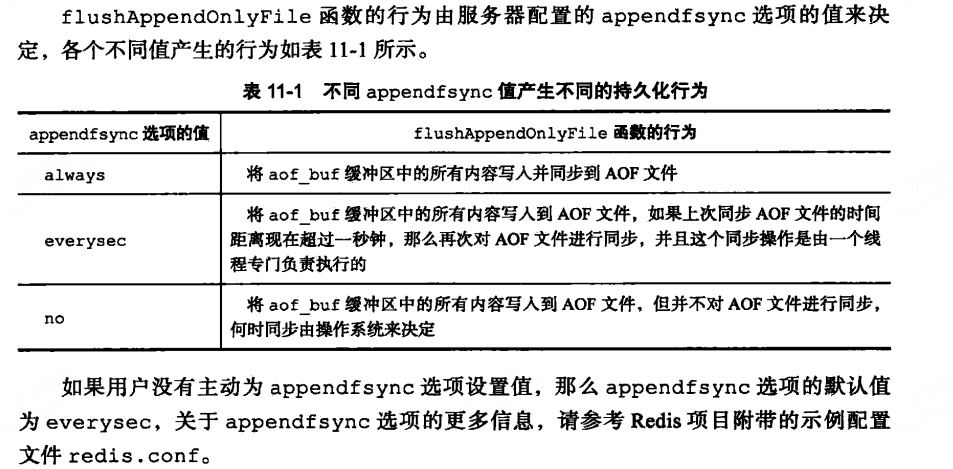

spring cloud 知识点总结

### spring cloud Feign

在应用主类上添加@EnableFeignClients注解，来开启Spring cloud Feign功能。

```java
@EnableFeignClients
@EnableDiscoveryClient
@SpringBootApplication
public class FeignconsumerApplication {

   public static void main(String[] args) {
      SpringApplication.run(FeignconsumerApplication.class, args);
   }

}

// 通过@FeignClient 注解指定服务名来绑定服务。 通过fallback 属性来实现服务降级
@FeignClient(value = "hello-service", configuration = DisableHystrixConfiguration.class,
fallback = HelloServiceFallback.class)
public interface HelloService {

    @RequestMapping(value = "/hello")
    public String hello();

    @RequestMapping(value = "/hello1")
    public String hello1(@RequestParam("name") String name);

    @RequestMapping(value = "/hello2")
    public User hello1(@RequestHeader("name") String name , @RequestHeader("age") Integer age);


    @RequestMapping(value = "/hello3",method = RequestMethod.POST)
    public String hello1(@RequestBody User user);
}

/**
 *   禁用  Hystrix 配置 在@FeigenClient 注解通过configuration引入该类，可以实现针对
 *   某一个客户端的禁用Hystrix
 */
@Configuration
public class DisableHystrixConfiguration {

    @Bean
    @Scope("prototype")
    public Feign.Builder feignBuilder(){
        return Feign.builder();
    }
}
```

### Spring cloud Zuul

在应用主类上，使用@EnableZuulProxy注解开启Zuul的API网关功能


```java
@EnableZuulProxy
@SpringBootApplication
public class EurekaApplication {

   public static void main(String[] args) {
      SpringApplication.run(EurekaApplication.class, args);
   }

}

# URL pattern
# 使用路径方式匹配路由规则。
# 参数key结构： zuul.routes.customName.path=xxx
# 用于配置路径匹配规则。
# 其中customName自定义。通常使用要调用的服务名称，方便后期管理
# 可使用的通配符有： * ** ?
# ? 单个字符
# * 任意多个字符，不包含多级路径
# ** 任意多个字符，包含多级路径
zuul.routes.eureka-application-service.path=/api/**
# 参数key结构： zuul.routes.customName.url=xxx
# url用于配置符合path的请求路径路由到的服务地址。
zuul.routes.eureka-application-service.url=http://127.0.0.1:8080/
```

**Zuul的作用**

​	1、统一入口：为全部服务提供一个唯一的入口，网关起到外部与内部隔离的作用。

​	2、鉴权校验：识别每个请求的权限，拒绝不符合条件的请求。

​	3、动态路由：动态的将请求路由到不同的后端集群中。

​	4、过滤恶意请求，设置IP白名单、限流。

**Zuul网关过滤器**

​	1、pre - 前置过滤器，在请求被路由之前执行，主要做一些前置加工，如身份认证，日志记录等。

​	2、rout过滤器：会进行具体的请求转发，找到对应的服务器实例。

​	3、post过滤器：rout或者error之后执行，可以获取实例的返回信息，可以对返回信息进行加工，收集服务信		  息，统计服务性能指标等。

​	4、error过滤器：上述三个阶段发生异常时或者远程调用超时未反馈时触发，用于处理异常，最终也会经过		  post过滤器，将结果返回给客户端。

**过滤器的生命周期**

​	 当外部HTTP请求到达API网关服务的时候，首先会进入pre前置过滤器，经过一些前置加工之后，会进入第二阶段rout过滤器，即请求转发阶段。这里的具体处理内容就是将外部请求转发到具体服务实例上，当服务实例将请求结果返回后，进入第三阶段post过滤器，该阶段可以对实例返回信息进行加工。然后将结果返回给客户端。如果在上述阶段发生异常或者请求超时异常，会进入error过滤器，处理完异常之后，最终还是要通过post过滤器将结果返回给前端。

**微服务网关Zuul和Gateway的区别**

​	Zuul：使用的是阻塞式的API，不支持长连接。不支持异步，流控由hystrix支持。

​	Gateway：提供了异步支持，提供了抽象负载均衡，提供了抽象流控。默认实现了RedisRateLimiter。

### Spring cloud config

在应用主类上使用@EnableConfigServer注解，开启Spring Cloud Config服务端

```java
@SpringBootApplication
@EnableConfigServer
public class ConfigServerApplication {

   public static void main(String[] args) {
      SpringApplication.run(ConfigServerApplication.class, args);
   }
}
# 客户端创建bootstrap.properties文件，并配置如下。
# 和git里的文件名对应
spring.application.name=config
# 远程仓库的分支
spring.cloud.config.label=master
# dev 开发环境配置文件 |  test 测试环境  |  pro 正式环境
# 和git里的文件名对应
#spring.cloud.config.profile=default
# 指明配置服务中心的网址
spring.cloud.config.uri= http://localhost:8888/
server.port=8080
```

### Spring Boot 知识点

**Spring boot 的核心注解**

启动类上面的注解是@SpringBootApplication，它也是 Spring Boot 的核心注解，主要组合包含了以下 3 个注解：

@SpringBootConfiguration：组合了 @Configuration 注解，实现配置文件的功能。

@EnableAutoConfiguration：打开自动配置的功能，也可以关闭某个自动配置的选项，如关闭数据源自动配置功能： @SpringBootApplication(exclude = { DataSourceAutoConfiguration.class })。

@ComponentScan：Spring组件扫描

**Spring boot的自动配置原理**

@SpringBootApplication是一个复合注解，包含一个@EnanbleAutoConfiguration注解，表示开启自动配置，该注解也是一个符合注解，通过@Import注解导入AutoConfigurationImportSelector的selectImports()方法扫描所有jar包中META-INF/spring.factories配置文件，该配置文件里面都是需要自动加载的配置类，都是以AuotConfiguration结尾来命名的，实际是一个JavaConfig形式的Spring配置类，在该类上会有一个@EnableConfigurationProperties注解，该注解负责导入这个已经绑定了属性的bean到spring的容器中，@ConfigurationProperties注解作用是从配置文件中绑定属性到对应的bean上。如server.port

```java
@Configuration
@AutoConfigureOrder(Ordered.HIGHEST_PRECEDENCE)
@ConditionalOnClass(ServletRequest.class)
@ConditionalOnWebApplication(type = Type.SERVLET)
@EnableConfigurationProperties(ServerProperties.class)
@Import({ ServletWebServerFactoryAutoConfiguration.BeanPostProcessorsRegistrar.class,
      ServletWebServerFactoryConfiguration.EmbeddedTomcat.class,
      ServletWebServerFactoryConfiguration.EmbeddedJetty.class,
      ServletWebServerFactoryConfiguration.EmbeddedUndertow.class })
public class ServletWebServerFactoryAutoConfiguration {
    ...
}

@ConfigurationProperties(prefix = "server", ignoreUnknownFields = true)
public class ServerProperties {

	/**
	 * Server HTTP port.
	 */
	private Integer port;

	/**
	 * Network address to which the server should bind.
	 */
	private InetAddress address;        
        
```

**Spring Boot配置文件读取的顺序**

如果在不同的目录中存在多个配置文件，它的读取顺序是：
 1、config/application.properties（项目根目录中config目录下）
 2、config/application.yml
 3、application.properties（项目根目录下）
 4、application.yml
 5、resources/config/application.properties（项目resources目录中config目录下）
 6、resources/config/application.yml
 7、resources/application.properties（项目的resources目录下）
 8、resources/application.yml

**Spring Boot如何使用XML文件配置**

Spring Boot 推荐使用 Java 配置而非 XML 配置，但是 Spring Boot 中也可以使用 XML 配置，通过 @ImportResource 注解可以引入一个 XML 配置。

```java
@SpringBootApplication(exclude = { DataSourceAutoConfiguration.class })
@ImportResource({"classpath*:spring/applicationContext.xml"})
@MapperScan("com.suning.epp.ppp.dao.mapper")
@EnableCaching
public class PppApplication extends SpringBootServletInitializer {
```

**Spring boot 和核心配置文件**

bootstrap.properties：是由父ApplicationContext加载，比application优加载，该文件属性不会被覆盖，配合Spring cloud config的时候会用到。

application.properties：由ApplicationContext加载，用户spring boot项目自动化配置。

**如何禁用一个特定的配置类**

```
// 可以使用 @EnableAutoConfiguration 的 exclude 属性。
@EnableAutoConfiguration(exclude={DataSourceAutoConfiguration.class})
// 可以使用注解的 excludeName 属性并指定完全限定名称。
@EnableAutoConfiguration(excludeName={Foo.class})
```

**Spring boot启动时运行一些特定的代码**

实现接口ApplicationRunner或者CommandLineRunner接口，并且重写run方法。

**如何自己实现一个Spring boot starter？**

1、引入相应的依赖jar

```java
 <dependencies>
    <dependency>
        <groupId>org.springframework.boot</groupId>
        <artifactId>spring-boot-configuration-processor</artifactId>
        <optional>true</optional>
    </dependency>
     <!-- 自动装配依赖 -->
    <dependency>
        <groupId>org.springframework.boot</groupId>
        <artifactId>spring-boot-autoconfigure</artifactId>
    </dependency>
</dependencies>

```

2、编写一个配置文件类，通过@ConfigurationProperties来读取指定的属性。

```
@ConfigurationProperties("target.string")
@getter
@setter
public class AutoConfigruationProperties {

    private String target;
}
```

3、编写一个自动装配的类，使用@EnableConfigurationProperties开启自动装配

```java
@Configuration
@EnableConfigurationProperties(AutoConfigruationProperties.class)
//将AutoConfigruationProperties类导入到spring上下文容器中去

@ConditionalOnClass(GetHashCodeClass.class)
public class AutoConfigrutionClass {
    @Autowired
    private AutoConfigruationProperties autoConfigruationProperties;

    @ConditionalOnMissingBean
    @Bean
    public GetHashCodeClass getHashCodeClass(){
        return new GetHashCodeClass(autoConfigruationProperties.getTarget());
    }
}
```

4、在resource/META-INF下添加spring.factories指定自动装配的类：

```
org.springframework.boot.autoconfigure.EnableAutoConfiguration=
com.myboot.AutoConfigrutionClass
在默认配置文件application.properties中添加：
target.spring.target=hello; 代码中就可以获取到对应的配置属性
```

# Spring 知识点

**Spring的常用注解**

@Value("xxx") : 将xxx字符串赋值给属性字段，xxx如果不是字符串的话，会报错

@Value("${xxx}")：会将xxx当做key，从properties文件中找出对应的value赋值给属性。如果没有找到，将${xxx}当做字符串注入到属性中

@Value("#{xxx}")：会将xxx作为spring的表达式进行解析，Spring会把xxx作为beanName去容器中找到对应的bean。找到就注入，否则报错	

```java
@Value("#{1}")
private int number; //获取数字 1

@Value("#{'Spring Expression Language'}") //获取字符串常量
private String str;

@Value("#{dataSource.url}") //获取bean的属性
private String jdbcUrl;
```
**Spring中有多少种IOC容器？**

1、BeanFactory：包含bean集合的一个工厂类，它的职责包括：实例化、定位、配置应用程序中的对象及建立这些对象间的依赖。不支持很多插件、功能，如：aop。使用懒加载，不支持国际化，不支持基于依赖的注解。

2、ApplicationContext：该接口扩展了BeanFactory接口，它在BeanFactory基础上提供了一些额外的功能。使用即时加载，支持国际化，支持基于依赖的注解。

FactoryBean：是一个工厂bean，可以返回bean的实例，我们可以实现该接口对bean进行额外的操作，在容器中通过getBean（String  beanName）获取Bean对象时，获取的是bean的实例对象，想要获取BeanFactory本身的实例需要在beanName前面加上$符号。如：（“$student”）

**Spring bean中的5中scope**

1、Singleton：单例，ioc容器中只有一个实例。

2、Prototype：每次请求都会产生一个新的实例。

3、Request：每一个请求都会产生一个新的实例，该实例只在当前的HTTP请求有效。

4、Session：每一个请求都会产生一个新的实例，该实例在当前HTTP Session内有效。

5、Global-session：他仅在portlet的web应用中才有用，如果在普通的web应用中使用，则会被当成session使用。

PS：再次说明request，session和global session类型只实用于web程序，通常是和XmlWebApplicationContext共同使用。

**Spring 的自动装配**

1、no：默认配置，表示没有自动装配，需要显式的去配置bean的引用。

2、byName：根据bean的名称注入对象依赖。匹配并装配和XML文件中有着相同名称的bean。

3、byType：根据类型注入对象依赖。匹配并装配和XML文件中有着相同类型的bean。

4、构造函数：通过调用类的构造函数来注意依赖项。

**如何启动Spring的注解装配**

默认情况下，spring容器未开启注解装配，通过配置<context: annotation-config/>元素来开启。

**Spring refresh()方法的执行流程**

```java
@Override
public void refresh() throws BeansException, IllegalStateException {
   // 来个锁，不然 refresh() 还没结束，你又来个启动或销毁容器的操作，那不就乱套了嘛
   synchronized (this.startupShutdownMonitor) {
 
      // 准备工作，记录下容器的启动时间、标记“已启动”状态、处理配置文件中的占位符
      prepareRefresh();
 
      // 创建BeanFactory = new DefaultListableBeanFactory()，
      // 调用loadBeanDefinitions(beanFactory)方法，将xml文件中的配置，转化成beanDfinition,并存放在map缓存中;
      // 当然，这里说的 Bean 还没有初始化，只是配置信息都提取出来了，
      // 注册也只是将这些信息都保存到了注册中心(说到底核心是一个 beanName-> beanDefinition 的 map)
      ConfigurableListableBeanFactory beanFactory = obtainFreshBeanFactory();
 
      // 设置 BeanFactory 的类加载器，支持表达式的解析器
      // 添加几个 BeanPostProcessor，【ApplicationContextAwareProcessor】
      // 设置忽略的自动装配的接口EnvironmentAware
       // 给BeanFactory注册一些能用的组件，environment，systemProperties
      prepareBeanFactory(beanFactory);
 
      try {
         // 【这里需要知道 BeanFactoryPostProcessor 这个知识点，Bean 如果实现了此接口，
         // 那么在容器初始化以后，Spring 会负责调用里面的 postProcessBeanFactory 方法。】
         // 这里是提供给子类的扩展点，到这里的时候，所有的 Bean 都加载、注册完成了，但是都还没有初始化
         // 第三方框架可以实现该接口，对自己的bean进行注册。如果mybaits中MapperScannerConfigurer类
         postProcessBeanFactory(beanFactory);
          
          
         // 调用 BeanFactoryPostProcessor 各个实现类的 postProcessBeanFactory(factory) 方法
         // BeanFactory的后置处理器，对所有实现beanFactoryPostProcessor的接口的bean，进行回调，执行postProcessBeanFactory()方法。
         // 先执行实现BeanDefinitionRegistryPostProcessor接口的bean，中的postProcessor.postProcessBeanDefinitionRegistry(registry)
         // 后执行实现BeanFactoryPostProcessor接口的bean中的，  postProcessor.postProcessBeanFactory(beanFactory)
          // 此步骤，主要是容器初始化完成后，对容器进行扩展，扩展业务可以在postProcessBeanFactory(beanFactory)中进行。
         invokeBeanFactoryPostProcessors(beanFactory);
 
         // 注册 BeanPostProcessor 的实现类，注意看和 BeanFactoryPostProcessor 的区别
         // 此接口两个方法: postProcessBeforeInitialization 和 postProcessAfterInitialization
         // 两个方法分别在 Bean 初始化之前和初始化之后得到执行。注意，到这里 Bean 还没初始化
         // 获取所有实现BeanPostProcessor接口的实现类，并且注册到容中，beanFactory.addBeanPostProcessor(postProcessor);
          // 先注册PriorityOrdered接口，再注册ordered接口。最后再注册没有实现任何优先级接口。
         registerBeanPostProcessors(beanFactory);
 
         // 初始化当前 ApplicationContext 的 MessageSource，国际化这里就不展开说了，不然没完没了了
         initMessageSource();
 
         // 初始化当前 ApplicationContext 的事件广播器，
         // 首先获取的beanFactory，从BeanFactory中获取applicationEventMulticaster，如果没有，则创建一个SimpleApplicationEventMulticaster，并注册到容器中。
         initApplicationEventMulticaster();
 
         // 从方法名就可以知道，典型的模板方法(钩子方法)，
         // 具体的子类可以在这里初始化一些特殊的 Bean（在初始化 singleton beans 之前）
         onRefresh();
 
         // 注册事件监听器，监听器需要实现 ApplicationListener 接口。
         // 获取所有的监听器，并且添加到事件广播器中。
         // 广播earlyApplicationEvents
         registerListeners();
 
         // 设置spring的转换器，ConversionService
         // 冻结缓存中的beandifinition,以防被修改
         // 初始化所有的 singleton beans
         //（lazy-init 的除外）
         finishBeanFactoryInitialization(beanFactory);
 
         // 初始化生命周期的后置处理器。lifeCyclePostProcessor;并且调用onFresh()方法。
         // 发布容器刷新事件
         finishRefresh();
      }
 
      catch (BeansException ex) {
         if (logger.isWarnEnabled()) {
            logger.warn("Exception encountered during context initialization - " +
                  "cancelling refresh attempt: " + ex);
         }
 
         // Destroy already created singletons to avoid dangling resources.
         // 销毁已经初始化的 singleton 的 Beans，以免有些 bean 会一直占用资源
         destroyBeans();
 
         // Reset 'active' flag.
         cancelRefresh(ex);
 
         // 把异常往外抛
         throw ex;
      }
 
      finally {
         // Reset common introspection caches in Spring's core, since we
         // might not ever need metadata for singleton beans anymore...
         resetCommonCaches();
      }
   }
}
```


**SpringMvc的执行流程**

1.用户发送请求至前端控制器DispatcherServlet。

 2.DispatcherServlet收到请求调用处理器映射器HandlerMapping。

 3.处理器映射器根据请求url找到具体的处理器，生成处理器执行链HandlerExecutionChain(包括处理器对象和处理器拦截器)一并返回给DispatcherServlet。

 4.DispatcherServlet根据处理器Handler获取处理器适配器HandlerAdapter执行HandlerAdapter处理一系列的操作，如：参数封装，数据格式转换，数据验证等操作

 5.执行处理器Handler(Controller，也叫页面控制器)。

 6.Handler执行完成返回ModelAndView

 7.HandlerAdapter将Handler执行结果ModelAndView返回到DispatcherServlet

 8.DispatcherServlet将ModelAndView传给ViewReslover视图解析器

 9.ViewReslover解析后返回具体View

 10.DispatcherServlet对View进行渲染视图（即将模型数据model填充至视图中）。

 11.DispatcherServlet响应用户

**Spring常用的注入方式**

```java


1、构造器注入。
public class Test1 {  
    private MessageInterface message;  
    @Autowired //构造器注入  
    private Test1(MessageInterface message) {  
        this.message = message;  
    } 
    //省略getter和setter  
  }
2、接口注入
 public class Test2 {  
    @Autowired //接口注入  
    private MessageInterface messageInterface;  
    //省略getter和setter  
}
3、set方法注入
 public class Test3 {  
    private MessageInterface message;  
 
    @Autowired //setter方法注入  
    public void setMessage(MessageInterface message) {  
        this.message = message;  
    }  
    public String getMessage() {  
        return message;  
    }  
}
@Autowired：spring的注解， 默认使用byType的方式进行装配，默认情况下要求依赖对象必须存在，如果允许依赖对象为null，需要设置required=false,如果使用byName的方式进行装配，可以配合@Qualifier("xxx")注解进行使用。
@Resource：JDK的注解，默认使用byName方式进行装配，可以通过name属性（@Resource(name="xxx")）进行制定名称，如果没有name属性，默认去字段名称进行查找装配，如果没有查到就会是用byType进行查找装配。如果指定了name属性或者type属性，就会按照byName或者byType的方式进行查找，查不到就抛异常。
```

**Spring的事务传播属性**

1、PROPAGATION_REQUIRED：支持当前事务，如果当前没有事务，就新建一个事务。这是最常见的选择，也是 Spring 默认的事务的传播。如果ServiceB.methodB() 的事务级别定义为 PROPAGATION_REQUIRED，那么执行 

ServiceA.methodA() 的时候spring已经起了事务，这时调用 ServiceB.methodB()，ServiceB.methodB() 看到自己

已经运行在 ServiceA.methodA() 的事务内部，就不再起新的事务。假如 ServiceB.methodB() 运行的时候发现自

己没有在事务中，他就会为自己分配一个事务。这样，在 ServiceA.methodA() 或者在 ServiceB.methodB() 内的任何地方出现异常，事务都会被回滚。

2、PROPAGATION_REQUIRES_NEW：新建事务，如果当前存在事务，把当前事务挂起。新建的事务将和被挂起的事务没有任何关系，是两个独立的事务，外层事务失败回滚之后，不能回滚内层事务执行的结果，内层事务失败抛出异常，外层事务捕获，也可以不处理回滚操作。

3、PROPAGATION_SUPPORTS：支持当前事务，如果当前没有事务，就以非事务方式执行。

4、PROPAGATION_MANDATORY：支持当前事务，如果当前没有事务，就抛出异常。

5、PROPAGATION_NOT_SUPPORTED：以非事务方式执行操作，如果当前存在事务，就把当前事务挂起。

6、PROPAGATION_NEVER：以非事务方式执行，如果当前存在事务，则抛出异常。

7、PROPAGATION_NESTED：如果一个活动的事务存在，则运行在一个嵌套的事务中。如果没有活动事务，则按REQUIRED属性执行。它使用了一个单独的事务，这个事务拥有多个可以回滚的保存点。内部事务的回滚不会对外部事务造成影响。它只对DataSourceTransactionManager事务管理器起效。

a、如果内部事务抛出异常，进行回滚，可以捕获异常，执行异常分支逻辑。

b、内部事务抛出异常，回滚到SavePoint，外部事务根据配置可以自己决定是提交事务还是回滚事务。

**SpringMVC中的拦截器和Servlet中的filter有什么区别？**

1、Filter：依赖于servlet容器，在请求进入容器后，未进入servlet之前进行预处理，在访问结束之后可以进行后续处理。使用Filter可以对请求修改字符编码，过滤低俗文字等。在容器初始化的时候调用一次，生命周期和servlet相同。执行顺序与web.xml的配置顺序有关。

2、interceptor：依赖于springMVC框架，基于java反射实现的，是AOP的一种，拦截器只能拦截Controller的请求，对其他的静态资源的访问不能拦截。可以在一个controller中多次使用，preHandle()，postHandle()，afterCompletion()方法。执行顺序与SpringMVC的配置文件中的配置顺序有关。

**Spring中如何解决bean的循环依赖？**

Spring的单例bean的初始化过程主要分为三步：

1、createBeanInstance：实例化，调用对象的构造方法进行实例化。

2、populateBean：填充属性，对多bean的依赖属性进行填充。

3、initializeBean：调用spring xml的init()方法，实现bean的初始化。

Spring的bean在第一步和第二步的时候容易产生循环依赖。解决问题主要是使用三级缓存。

```java
singletonObjects指单例对象的cache （一级缓存）
private final Map<String, Object> singletonObjects = new ConcurrentHashMap<String, Object>(256);

earlySingletonObjects指提前曝光的单例对象的cache（二级缓存）
private final Map<String, Object> earlySingletonObjects = new HashMap<String, Object>(16);

singletonFactories指单例对象工厂的cache（三级缓存）
private final Map<String, ObjectFactory<?>> singletonFactories = new HashMap<String, ObjectFactory<?>>(16);

protected Object getSingleton(String beanName, boolean allowEarlyReference) {
 从一级缓存获取
   Object singletonObject = this.singletonObjects.get(beanName);
   if (singletonObject == null && isSingletonCurrentlyInCreation(beanName)) {
      synchronized (this.singletonObjects) {
       从二级缓存获取
         singletonObject = this.earlySingletonObjects.get(beanName);
         if (singletonObject == null && allowEarlyReference) {
          从三级缓存获取
            ObjectFactory<?> singletonFactory = this.singletonFactories.get(beanName);
            if (singletonFactory != null) {
               singletonObject = singletonFactory.getObject();
               this.earlySingletonObjects.put(beanName, singletonObject);
               this.singletonFactories.remove(beanName);
            }
         }
      }
   }
   return (singletonObject != NULL_OBJECT ? singletonObject : null);
}
```

首先Spring会调用getSingleton(String beanName, boolean allowEarlyReference)来获取想要的单例对象，首先会在singletonObjects的一级缓存的集合中去获取对象，如果没有获取成功的话调用isSingletonCurrentlyInCreation(beanName)判断单例对象是否在创建中，如果是会从二级缓存（earlySingletionObjects）中获取，如果又没有获取到的话，根据传进来的allowEarlyReference字段判断是否能从三级缓存（objectFactory）中获取，如果可以，从三级缓存中获取对应的实例对象后，删除三级缓存中的实例对象，并添加到二级缓存中去。如A对象实例化之后，进行属性填充发现需要依赖B对象，此时去getBean（B）,由于B需要依赖A，getBean（A）；先从一级缓存获取，由于A没有初始化完成获取不到，去二级缓存中获取（也没有），去三级缓存中获取，可以获取未初始化的A的实例，B完成初始化，并将自己放入一级缓存中，然后A也能从一级缓存中获取B然后完成初始化。

通过三级缓存加上“提前曝光”机制，配合java的对象引用原理，可以解决setter方法的循环依赖。构造方法的循环依赖无法解决。

**Spring容器的bean什么时候被实例化**

（1）如果你使用BeanFactory作为Spring Bean的工厂类，则所有的bean都是在第一次使用该Bean的时候实例化
（2）如果你使用ApplicationContext作为Spring Bean的工厂类，则又分为以下几种情况：
如果bean的scope是singleton的，并且lazy-init为false（默认是false，所以可以不用设置），则 ApplicationContext启动的时候就实例化该Bean，并且将实例化的Bean放在一个map结构的缓存中，下次再使 用该 Bean的时候，直接从这个缓存中取
如果bean的scope是singleton的，并且lazy-init为true，则该Bean的实例化是在第一次使用该Bean的时候进行实例化。
如果bean的scope是prototype的，则该Bean的实例化是在第一次使用该Bean的时候进行实例化。

**Spring bean的生命周期**


1、spring加载并解析配置文件，生成beanDifition；

2、根据beanName先从缓存中获取对应的bean，如果没有获取到。就会触发bean的创建过程，doCreateBean()；

3、判断该bean是否有实现InstantiationAwareBeanPostProcessor接口，如果实现了该接口，调用postProcessBeforeInstantiation(beanClass,beanName);如果有返回值，则会调用postProcessAfterInstantiation(beanClass,beanName)方法。该方法如果返回了对象，整个spring流程结束，返回该代理对象。

4、调用createInstance()方法进行实例化，推断构造方法（SmartInstantiationAwareBeanPostProcessor.determineCandidateConstructors();通过该方法来推断出具体使用哪个构造方法实例化bean），或者使用工厂实例化bean。

5、调用SmartInstantiationAwareBeanPostProcessor.getEarlyBeanReference()方法。提前暴露对象的引用。实例化后调用InstantiationAwareBeanPostProcessor.postProcessAfterInstantiation()方法。

6、调用populateBean()方法进行属性注入。调用InstantiationAwareBeanPostProcessor.postProcessPropertyValues()方法，进行属性注入。通过AutowiredAnnotationBeanPostProcessor类，对@Autowired，@Value注解进行属性注入。通过CommonAnnotationBeanPostProcessor类，对@Resource注解进行注入。

7、bean如果实现了BeanNameAware接口，回调setBeanName(beanName)方法。

​	  bean如果实现了BeanClassLoaderAware接口，回调setBeanClassLoader()方法。

​      bean如果实现了BeanFactoryAware接口，回调setBeanFactory()方法。

8、初始化前调用BeanPostProcessor.postProcessBeforeInitialization()方法。

​	  bean如果实现了InitializingBean接口，回调afterPropertiesSet()方法。

​	   调用xml中init-method方法。或者@Bean(init)方法对bean进行初始化。

9、初始化结束后，调用BeanPostProcesser.postProcessAfterInitializetion()方法。

10、如果bean设置了destory-method属性声明了销毁方法，在销毁Bean的时候会调用

**Spring bean的加载流程**

初始化环境—>加载配置文件—>实例化Bean—>调用Bean显示信息

首先从大的几个核心步骤来去说明，因为Spring中的具体加载过程和用到的类实在是太多了。

（1）、首先是先从AbstractBeanFactory中去调用doGetBean（name, requiredType, final Object[] args, boolean typeCheckOnly【这个是判断进行创建bean还是仅仅用来做类型检查】）方法，然后第一步要做的就是先去对传入的参数name进行做转换，因为有可能传进来的name=“&XXX”之类，需要去除&符号

（2）、然后接着是去调用getSingleton（）方法，其实在上一个面试题中已经提到了这个方法，这个方法就是利用“三级缓存” 来去避免循环依赖问题的出现的。【这里补充一下，只有在是单例的情况下才会去解决循环依赖问题】

（3）、对从缓存中拿到的bean其实是最原始的bean，还未长大，所以这里还需要调用getObjectForBeanInstance（Object beanInstance, String name, String beanName, RootBeanDefinition mbd）方法去进行实例化。

（4）、然后会解决单例情况下尝试去解决循环依赖，如果isPrototypeCurrentlyInCreation（beanName）返回为true的话，会继续下一步，否则throw new BeanCurrentlyInCreationException(beanName);

（5）、因为第三步中缓存中如果没有数据的话，就直接去parentBeanFactory中去获取bean，然后判断containsBeanDefinition（beanName）中去检查已加载的XML文件中是否包含有这样的bean存在，不存在的话递归去getBean（）获取，如果没有继续下一步

（6）、这一步是吧存储在XML配置文件中的GernericBeanDifinition转换为RootBeanDifinition对象。这里主要进行一个转换，如果父类的bean不为空的话，会一并合并父类的属性

（7）、这一步核心就是需要跟这个Bean有关的所有依赖的bean都要被加载进来，通过刚刚的那个RootBeanDifinition对象去拿到所有的beanName,然后通过registerDependentBean（dependsOnBean, beanName）注册bean的依赖

（8）、然后这一步就是会根据我们在定义bean的作用域的时候定义的作用域是什么，然后进行判断在进行不同的策略进行创建（比如isSingleton、isPrototype）

（9）、这个是最后一步的类型装换，会去检查根据需要的类型是否符合bean的实际类型去做一个类型转换。Spring中提供了许多的类型转换器

# Mybatis

## Mybatis应用知识点

**mybatis中#{}和${}的区别是什么？**

#{}预编译处理：在处理#{}时会替换成为？，调用PreparedStatement的set方法来赋值。可以防止sql注入，更安全。

${}字符串替换：处理${}会直接替换成变量值。

**Mybatis的分页方式？**

1、数组分页，直接将所有的数据查出来，通过List.subList(firstIndex，lastIndex);截取list实现分页。

2、sql分页

```java
<select id="queryStudentsBySql" parameterType="map" resultMap="studentmapper">
        select * from student limit #{currIndex} , #{pageSize}
</select>
```

3、拦截器分页

4、RowBounds实现分页。

**mybatis如何编写自定义插件？**

Configuration 初始化基础配置，比如MyBatis的别名等，一些重要的类型对象，如，插件，映射器，ObjectFactory和typeHandler对象，MyBatis所有的配置信息都维持在Configuration对象之中

SqlSessionFactory  SqlSession工厂

SqlSession 作为MyBatis工作的主要顶层API，表示和数据库交互的会话，完成必要数据库增删改查功能

Executor MyBatis执行器，是MyBatis 调度的核心，负责SQL语句的生成和查询缓存的维护

StatementHandler   封装了JDBC Statement操作，负责对JDBC statement 的操作，如设置参数、将Statement结果集转换成List集合。

ParameterHandler   负责对用户传递的参数转换成JDBC Statement 所需要的参数，

ResultSetHandler    负责将JDBC返回的ResultSet结果集对象转换成List类型的集合；

TypeHandler          负责java数据类型和jdbc数据类型之间的映射和转换

MappedStatement   MappedStatement维护了一条<select|update|delete|insert>节点的封装， 

SqlSource            负责根据用户传递的parameterObject，动态地生成SQL语句，将信息封装到BoundSql对象中，并返回

BoundSql 表示动态生成的SQL语句以及相应的参数信息

```java
/**
* @Description:    类功能说明：为mybatis的update操作添加拦截器，用来在更新数据时更新modifydate
* @Title:          UpdateInterceptor
	mybatis支持对Executor、StatementHandler、PameterHandler、ResultSetHandler接口进行拦截。
*/
@Intercepts({@Signature(type = Executor.class, method = "update", args = {MappedStatement.class, Object.class})})
public class UpdateInterceptor implements Interceptor{

    private Logger log = LoggerFactory.getLogger(UpdateInterceptor.class);

    @Override
    public Object intercept(Invocation invocation) throws Throwable {
        MappedStatement mappedStatement = (MappedStatement) invocation.getArgs()[0];
        //注解中method的值
        String methodName = invocation.getMethod().getName();
        //sql类型
        SqlCommandType sqlCommandType = mappedStatement.getSqlCommandType();
        if ("update".equals(methodName)) {
            Object object = invocation.getArgs()[1];
            Date currentDate = new Date(System.currentTimeMillis());
            //对有要求的字段填值
            if (SqlCommandType.UPDATE.equals(sqlCommandType)) {
                Field[] fields = object.getClass().getSuperclass().getDeclaredFields();
                for (Field field : fields){
                    if ("modify_date".equals(field.getName())){
                        Method method = object.getClass().getMethod("setModify_date",Date.class);
                        method.invoke(object,currentDate);
                        log.info("更新操作时设置modify_date:{}", currentDate);
                        break;
                    }
                }
            }
        }
        return invocation.proceed();
    }

    @Override
    public Object plugin(Object target) {
        return Plugin.wrap(target, this);
    }

    @Override
    public void setProperties(Properties properties) {
    }

}
```

**Mybatis的一级缓存和二级缓存**

1、一级缓存：是sqlSession级别的缓存，在同一个sqlSession中执行相同的SQL，第一次会查询数据库，并写入到缓存中，第二次会直接从缓存中获取。当发生增删改的操作的时候会清空一级缓存，sqlSession关闭的时候也会清空一级缓存。Mybatis默认开启一级缓存。

2、二级缓存：是基于mapper文件的namespace的，多个sqlSession可以共享同一个mapper的二级缓存，默认是不开启的。实现二级缓存需要配置<cache/> ，并且pojo必须是实现了Serializable接口。所有的select语句会被缓存，增删改语句会重新刷新缓存。

```java
<!--开启本mapper的namespace下的二级缓存-->
    <!--
        eviction:代表的是缓存回收策略，目前MyBatis提供以下策略。
        (1) LRU,最近最少使用的，一处最长时间不用的对象
        (2) FIFO,先进先出，按对象进入缓存的顺序来移除他们
        (3) SOFT,软引用，移除基于垃圾回收器状态和软引用规则的对象
        (4) WEAK,弱引用，更积极的移除基于垃圾收集器状态和弱引用规则的对象。这里采用的是LRU，
                移除最长时间不用的对形象

        flushInterval:刷新间隔时间，单位为毫秒，这里配置的是100秒刷新，如果你不配置它，那么当
        SQL被执行的时候才会去刷新缓存。

        size:引用数目，一个正整数，代表缓存最多可以存储多少个对象，不宜设置过大。设置过大会导致内存溢出。
        这里配置的是1024个对象

        readOnly:只读，意味着缓存数据只能读取而不能修改，这样设置的好处是我们可以快速读取缓存，缺点是我们没有
        办法修改缓存，他的默认值是false，不允许我们修改
    -->
```

**Mybatis的延迟加载的原理？**

启用延迟加载有两种方式：第一种是在对应的<collection>或<association>标签上指定fetchType属性值为“lazy”。第二种开启全局的延迟加载。   <setting name="lazyLoadingEnabled" value="true"/>。

Mybatis仅支持association（一对一）关联对象和collection（一对多）关联集合对象的延迟加载，Mybatis先是根据正常情况创建一个返回类型对应的对象。当我们的ResultMap是包含子查询的时候，其会在我们正常返回类型对象的基础上创建对应的代理对象。通过CGLIB或者JAVASSIST来创建代理对象。我们在访问这个对象的时候都会触发延迟加载的对象信息。通过aggressiveLazyLoading来改变他的策略。设置为false时，在第一次访问代理对象才从数据库中加载出对应的信息。

**Mybatis具有哪些执行器（Executor）？**

**SimpleExecutor：**每执行一次update或select，就开启一个Statement对象，用完立刻关闭Statement对象。

**ReuseExecutor：**执行update或select，以sql作为key查找Statement对象，存在就使用，不存在就创建，用完后，不关闭Statement对象，而是放置于Map内，供下一次使用。简言之，就是重复使用Statement对象。

**BatchExecutor：**执行update（没有select，JDBC批处理不支持select），将所有sql都添加到批处理中（addBatch()），等待统一执行（executeBatch()），它缓存了多个Statement对象，每个Statement对象都是addBatch()完毕后，等待逐一执行executeBatch()批处理。与JDBC批处理相同。

## **mybaits源码解析**

```java
		// 调用解析流程
		// 1.指定全局配置文件路径
		String location = "mybatis-config.xml";
		// 2.加载配置文件成InputStream
		InputStream inputStream = Resources.getResourceAsStream(location);
		// 通过构建者模式，加载并解析mybatis的全局配置文件。并且解析mapper.xml文件
		SqlSessionFactory sqlSessionFactory = new SqlSessionFactoryBuilder().build(inputStream);
		// 获取sqlSession
		SqlSession sqlSession = sqlSessionFactory.openSession();

		User param = new User();
		param.setId(1);

		// 映射文件中的statementId，由namespace和statementId组成
		String statementId = "test.findUserById";

		User user = sqlSession.selectOne(statementId, param);

		System.out.println(user);
```
1. 加载全局配置文件流程，SqlSessionFactoryBuilder#build()方法

   ```java
   源码流程：
   SqlSessionFactoryBuilder#build()方法；通过构建者模式加载字节流，并解析全局配置文件，最终生成SqlSessionFactory;
   	|-- XMLConfigBuilder#构造方法；生成全局配置文件的解析器
           |--  XPathParser#构造方法：生成解析xpath语法的xml文件的解析器
           	|-- XPathParser#parse();从配置文件的根节点开始解析
       |-- SqlSessionFactoryBuilder#build()方法；创建DefaultSqlSessionFactory;
   
   public SqlSessionFactory build(InputStream inputStream, String environment, Properties properties) {
      try {
        // XMLConfigBuilder:用来解析XML配置文件
        // 使用构建者模式
        XMLConfigBuilder parser = new XMLConfigBuilder(inputStream, environment, properties);
        // parser.parse()：使用XPATH解析XML配置文件，将配置文件封装为Configuration对象
        // 返回DefaultSqlSessionFactory对象，该对象拥有Configuration对象（封装配置文件信息）
        return build(parser.parse());
      } catch (Exception e) {
        throw ExceptionFactory.wrapException("Error building SqlSession.", e);
      } finally {
        ErrorContext.instance().reset();
        try {
          inputStream.close();
        } catch (IOException e) {
          // Intentionally ignore. Prefer previous error.
        }
      }
    }
      
    public SqlSessionFactory build(Configuration config) {
   // 创建SqlSessionFactory接口的默认实现类
      return new DefaultSqlSessionFactory(config);
    }
   
   ```

   2、加载mapper.xml配置文件。XMLConfigBuilder#mapperElement

   ```java
   流程分析：
        |-- configuration#addMappers:获取package的名称
            |-- MapperRegistry#addMappers:获取该包下的所有mapper接口，并添加到configrution中。
                |-- MapperRegistry#addMapper:将mapper的接口作为key，mapperProxyFactory作为value，存入到knownMappers中
                |-- MapperAnnotationBuilder#parse:解析并生成mappedStatement
                |-- MapperAnnotationBuilder#loadXmlResource：解析mapper的xml文件。
                    |-- XMLMapperBuilder#configurationElement:解析mapper映射文件的各个node
                   
   /**
    * 解析<mappers>标签
    * @param parent  mappers标签对应的XNode对象
    	分支流程，分别对应着mapper文件的4中配置形式（配置包名，xml文件路径名，class,url）
    * @throws Exception
    */
   private void mapperElement(XNode parent) throws Exception {
     if (parent != null) {
       // 获取<mappers>标签的子标签
       for (XNode child : parent.getChildren()) {
      // <package>子标签
         if ("package".equals(child.getName())) {
           // 获取mapper接口和mapper映射文件对应的package包名
           String mapperPackage = child.getStringAttribute("name");
           // 将包下所有的mapper接口以及它的代理对象存储到一个Map集合中，key为mapper接口类型，value为代理对象工厂
           configuration.addMappers(mapperPackage);
         } else {// <mapper>子标签
           // 获取<mapper>子标签的resource属性
           String resource = child.getStringAttribute("resource");
           // 获取<mapper>子标签的url属性
           String url = child.getStringAttribute("url");
           // 获取<mapper>子标签的class属性
           String mapperClass = child.getStringAttribute("class");
           // 它们是互斥的
           if (resource != null && url == null && mapperClass == null) {
             ErrorContext.instance().resource(resource);
             InputStream inputStream = Resources.getResourceAsStream(resource);
             // 专门用来解析mapper映射文件
             XMLMapperBuilder mapperParser = new XMLMapperBuilder(inputStream, configuration, resource, configuration.getSqlFragments());
             // 通过XMLMapperBuilder解析mapper映射文件
             mapperParser.parse();
           } else if (resource == null && url != null && mapperClass == null) {
             ErrorContext.instance().resource(url);
             InputStream inputStream = Resources.getUrlAsStream(url);
             XMLMapperBuilder mapperParser = new XMLMapperBuilder(inputStream, configuration, url, configuration.getSqlFragments());
             // 通过XMLMapperBuilder解析mapper映射文件
             mapperParser.parse();
           } else if (resource == null && url == null && mapperClass != null) {
             Class<?> mapperInterface = Resources.classForName(mapperClass);
             // 将指定mapper接口以及它的代理对象存储到一个Map集合中，key为mapper接口类型，value为代理对象工厂
             configuration.addMapper(mapperInterface);
           } else {
             throw new BuilderException("A mapper element may only specify a url, resource or class, but not more than one.");
           }
         }
       }
     }
   }
   
    /**
      * @since 3.2.2
      */
     public void addMappers(String packageName, Class<?> superType) {
       ResolverUtil<Class<?>> resolverUtil = new ResolverUtil<>();
       // 根据package名称，加载该包下Mapper接口文件（不是映射文件）
       resolverUtil.find(new ResolverUtil.IsA(superType), packageName);
       // 获取加载的Mapper接口
       Set<Class<? extends Class<?>>> mapperSet = resolverUtil.getClasses();
       for (Class<?> mapperClass : mapperSet) {
         // 将Mapper接口添加到MapperRegistry中
         addMapper(mapperClass);
       }
     }
   
     /**
      * @since 3.2.2
      */
     public void addMappers(String packageName) {
       addMappers(packageName, Object.class);
     }
   //循环遍历，解析每一个mapper，并生成mappedStatement
   public <T> void addMapper(Class<T> type) {
       if (type.isInterface()) {
         // 如果Map集合中已经有该mapper接口的映射，就不需要再存储了
         if (hasMapper(type)) {
           throw new BindingException("Type " + type + " is already known to the MapperRegistry.");
         }
         boolean loadCompleted = false;
         try {
       	// 将mapper接口以及它的代理对象存储到一个Map集合中，key为mapper接口类型，value为代理对象工厂
           knownMappers.put(type, new MapperProxyFactory<T>(type));
           // It's important that the type is added before the parser is run
           // otherwise the binding may automatically be attempted by the
           // mapper parser. If the type is already known, it won't try.
           
           // 用来解析注解方式的mapper接口
           MapperAnnotationBuilder parser = new MapperAnnotationBuilder(config, type);
           // 解析注解方式的mapper接口
           parser.parse();
           loadCompleted = true;
         } finally {
           if (!loadCompleted) {
             knownMappers.remove(type);
           }
         }
       }
     }
   // 首先
   public void parse() {
   	// 获取mapper接口的全路径
       String resource = type.toString();
       // 是否解析过该mapper接口
       if (!configuration.isResourceLoaded(resource)) {
         // 先解析mapper映射文件（根据mapper的全路径名称，获取对应的xml文件，有就解析，没有就不解析）
         loadXmlResource();
         // 设置解析标识
         configuration.addLoadedResource(resource);
         // Mapper构建者助手
         assistant.setCurrentNamespace(type.getName());
         // 解析CacheNamespace注解
         parseCache();
         // 解析CacheNamespaceRef注解
         parseCacheRef();
         // 通过反射获取mapper下所有的方法。
         Method[] methods = type.getMethods();
         for (Method method : methods) {
           try {
             // issue #237
             if (!method.isBridge()) {
           	// 每个mapper接口中的方法，都解析成MappedStatement对象
               parseStatement(method);
             }
           } catch (IncompleteElementException e) {
             configuration.addIncompleteMethod(new MethodResolver(this, method));
           }
         }
       }
       parsePendingMethods();
     }
   
     public void parse() {
   	// mapper映射文件是否已经加载过
       if (!configuration.isResourceLoaded(resource)) {
         // 从映射文件中的<mapper>根标签开始解析，直到完整的解析完毕
         configurationElement(parser.evalNode("/mapper"));
         // 标记已经解析
         configuration.addLoadedResource(resource);
         bindMapperForNamespace();
       }
   
       parsePendingResultMaps();
       parsePendingCacheRefs();
       parsePendingStatements();
     }
   // 解析mapper.xml文件中的 CRUD标签
   private void buildStatementFromContext(List<XNode> list, String requiredDatabaseId) {
       for (XNode context : list) {
         // MappedStatement解析器
         final XMLStatementBuilder statementParser = new XMLStatementBuilder(configuration, builderAssistant, context, requiredDatabaseId);
         try {
       	// 解析select等4个标签，创建MappedStatement对象
           statementParser.parseStatementNode();
         } catch (IncompleteElementException e) {
           configuration.addIncompleteStatement(statementParser);
         }
       }
     }
   
   /**
      * 解析<select>\<insert>\<update>\<delete>子标签
      */
     public void parseStatementNode() {
   	// 获取statement的id属性（特别关键的值）
       String id = context.getStringAttribute("id");
       String databaseId = context.getStringAttribute("databaseId");
   
       if (!databaseIdMatchesCurrent(id, databaseId, this.requiredDatabaseId)) {
         return;
       }
   
       Integer fetchSize = context.getIntAttribute("fetchSize");
       Integer timeout = context.getIntAttribute("timeout");
       String parameterMap = context.getStringAttribute("parameterMap");
       // 获取入参类型
       String parameterType = context.getStringAttribute("parameterType");
       // 别名处理，获取入参对应的Java类型
       Class<?> parameterTypeClass = resolveClass(parameterType);
       // 获取ResultMap
       String resultMap = context.getStringAttribute("resultMap");
       // 获取结果映射类型
       String resultType = context.getStringAttribute("resultType");
       String lang = context.getStringAttribute("lang");
       LanguageDriver langDriver = getLanguageDriver(lang);
       
       // 别名处理，获取返回值对应的Java类型
       Class<?> resultTypeClass = resolveClass(resultType);
       String resultSetType = context.getStringAttribute("resultSetType");
       
       // 设置默认StatementType为Prepared，该参数指定了后面的JDBC处理时，采用哪种Statement
       StatementType statementType = StatementType.valueOf(context.getStringAttribute("statementType", StatementType.PREPARED.toString()));
       ResultSetType resultSetTypeEnum = resolveResultSetType(resultSetType);
   
       String nodeName = context.getNode().getNodeName();
       // 解析SQL命令类型是什么？确定操作是CRUD中的哪一种
       SqlCommandType sqlCommandType = SqlCommandType.valueOf(nodeName.toUpperCase(Locale.ENGLISH));
       //是否查询语句
       boolean isSelect = sqlCommandType == SqlCommandType.SELECT;
       boolean flushCache = context.getBooleanAttribute("flushCache", !isSelect);
       boolean useCache = context.getBooleanAttribute("useCache", isSelect);
       boolean resultOrdered = context.getBooleanAttribute("resultOrdered", false);
   
       // Include Fragments before parsing
       // <include>标签解析
       XMLIncludeTransformer includeParser = new XMLIncludeTransformer(configuration, builderAssistant);
       includeParser.applyIncludes(context.getNode());
   
       // Parse selectKey after includes and remove them.
       // 解析<selectKey>标签
       processSelectKeyNodes(id, parameterTypeClass, langDriver);
       
       // Parse the SQL (pre: <selectKey> and <include> were parsed and removed)
       // 创建SqlSource，解析SQL，封装SQL语句（未参数绑定）和入参信息
       SqlSource sqlSource = langDriver.createSqlSource(configuration, context, parameterTypeClass);
      
       String resultSets = context.getStringAttribute("resultSets");
       String keyProperty = context.getStringAttribute("keyProperty");
       String keyColumn = context.getStringAttribute("keyColumn");
       KeyGenerator keyGenerator;
       String keyStatementId = id + SelectKeyGenerator.SELECT_KEY_SUFFIX;
       keyStatementId = builderAssistant.applyCurrentNamespace(keyStatementId, true);
       if (configuration.hasKeyGenerator(keyStatementId)) {
         keyGenerator = configuration.getKeyGenerator(keyStatementId);
       } else {
         keyGenerator = context.getBooleanAttribute("useGeneratedKeys",
             configuration.isUseGeneratedKeys() && SqlCommandType.INSERT.equals(sqlCommandType))
             ? Jdbc3KeyGenerator.INSTANCE : NoKeyGenerator.INSTANCE;
       }
   
       // 通过构建者助手，创建MappedStatement对象
       builderAssistant.addMappedStatement(id, sqlSource, statementType, sqlCommandType,
           fetchSize, timeout, parameterMap, parameterTypeClass, resultMap, resultTypeClass,
           resultSetTypeEnum, flushCache, useCache, resultOrdered, 
           keyGenerator, keyProperty, keyColumn, databaseId, langDriver, resultSets);
     }
   ```

   **3、创建SQLSource流程：LanguageDriver#createSqlSource**

   ```java
   流程分析：
       |-- XMLLanguageDriver#createSqlSource：创建XMLScriptBuilder来进行xml文件中的动态sql解析
       	|-- XMLScriptBuilder#parseScriptNode：解析sql语句，将最终解析的MixSqlNode中的list中，
       		带有${}的SQL封装到TextSqlNode中，带有#{}的SQL封装到StaticTextSqlNode中。动态sql封装到不同的sqlNode中
       	SqlSource -- | DynamicSqlSource；含有${}和动态sql语句封装在DynamicSqlSource
       				 |	RawSqlSource: 含有#{}的sql语句，封装在RawSqlSource
   
   @Override
   public SqlSource createSqlSource(Configuration configuration, XNode script, Class<?> parameterType) {
      // 初始化了动态SQL标签处理器
      XMLScriptBuilder builder = new XMLScriptBuilder(configuration, script, parameterType);
      // 解析动态SQL
      return builder.parseScriptNode();
   }
   
   public SqlSource parseScriptNode() {
   		// 解析select\insert\ update\delete标签中的SQL语句，最终将解析到的SqlNode封装到MixedSqlNode中的List集合中
   		// ****将带有${}号的SQL信息封装到TextSqlNode
   		// ****将带有#{}号的SQL信息封装到StaticTextSqlNode
   		// ****将动态SQL标签中的SQL信息分别封装到不同的SqlNode中
   		MixedSqlNode rootSqlNode = parseDynamicTags(context);
   		SqlSource sqlSource = null;
   		// 如果SQL中包含${}和动态SQL语句，则将SqlNode封装到DynamicSqlSource
   		if (isDynamic) {
               // DynamicSqlSource动态sql每次getBoundSql都会去拼装sql
   			sqlSource = new DynamicSqlSource(configuration, rootSqlNode);
   		} else {
   			// 如果SQL中包含#{}，则将SqlNode封装到RawSqlSource中，并指定parameterType
               // 在构造方法中解析一次，每次调用的时候都拿的是同一个sql语句
   			sqlSource = new RawSqlSource(configuration, rootSqlNode, parameterType);
   		}
   		return sqlSource;
   	}
   
   	protected MixedSqlNode parseDynamicTags(XNode node) {
   		List<SqlNode> contents = new ArrayList<>();
   		//获取<select>\<insert>等4个标签的子节点，子节点包括元素节点和文本节点
   		NodeList children = node.getNode().getChildNodes();
   		for (int i = 0; i < children.getLength(); i++) {
   			XNode child = node.newXNode(children.item(i));
   			// 处理文本节点
   			if (child.getNode().getNodeType() == Node.CDATA_SECTION_NODE
   					|| child.getNode().getNodeType() == Node.TEXT_NODE) {
   				String data = child.getStringBody("");
   				// 将文本内容封装到SqlNode中
   				TextSqlNode textSqlNode = new TextSqlNode(data);
   				// SQL语句中带有${}的话，就表示是dynamic的
   				if (textSqlNode.isDynamic()) {
   					contents.add(textSqlNode);
   					isDynamic = true;
   				} else {
   					// SQL语句中（除了${}和下面的动态SQL标签），就表示是static的
   					// StaticTextSqlNode的apply只是进行字符串的追加操作
   					contents.add(new StaticTextSqlNode(data));
   				}
   				
   				//处理元素节点
   			} else if (child.getNode().getNodeType() == Node.ELEMENT_NODE) { // issue #628
   				String nodeName = child.getNode().getNodeName();
   				// 动态SQL标签处理器
   				// 思考，此处使用了哪种设计模式？---策略模式
   				NodeHandler handler = nodeHandlerMap.get(nodeName);
   				if (handler == null) {
   					throw new BuilderException("Unknown element <" + nodeName + "> in SQL statement.");
   				}
   				handler.handleNode(child, contents);
   				// 动态SQL标签是dynamic的
   				isDynamic = true;
   			}
   		}
   		return new MixedSqlNode(contents);
   	}
   // 初始化不同的sqlNode的handler，不同的handler去处理不同的sqlNode
   private void initNodeHandlerMap() {
   		nodeHandlerMap.put("trim", new TrimHandler());
   		nodeHandlerMap.put("where", new WhereHandler());
   		nodeHandlerMap.put("set", new SetHandler());
   		nodeHandlerMap.put("foreach", new ForEachHandler());
   		nodeHandlerMap.put("if", new IfHandler());
   		nodeHandlerMap.put("choose", new ChooseHandler());
   		nodeHandlerMap.put("when", new IfHandler());
   		nodeHandlerMap.put("otherwise", new OtherwiseHandler());
   		nodeHandlerMap.put("bind", new BindHandler());
   	}
   
   
   	// 获取boundSql；首先根据出入的参数，判断并拼接sql语句，并且将传入的参数封装在metaParameters中。
   	@Override
   	public BoundSql getBoundSql(Object parameterObject) {
   		DynamicContext context = new DynamicContext(configuration, parameterObject);
   		// 此处会调用MixedSqlNode中包含的所有SqlNode的apply方法
   		// 此处会处理${}，也会处理动态标签
   		// 最终将所有的SqlNode信息进行解析之后，追加到DynamicContext对象的StringBuilder对象中
   		rootSqlNode.apply(context);
   		// 创建SQL信息解析器
   		SqlSourceBuilder sqlSourceParser = new SqlSourceBuilder(configuration);
   		// 获取入参类型
   		Class<?> parameterType = parameterObject == null ? Object.class : parameterObject.getClass();
   		// 执行解析：将带有#{}的SQL语句进行解析，然后封装到StaticSqlSource中
   		SqlSource sqlSource = sqlSourceParser.parse(context.getSql(), parameterType, context.getBindings());
   		// 将解析后的SQL语句还有入参绑定到一起（封装到一个对象中，此时还没有将参数替换到SQL占位符?）
   		BoundSql boundSql = sqlSource.getBoundSql(parameterObject);
   		for (Map.Entry<String, Object> entry : context.getBindings().entrySet()) {
   			boundSql.setAdditionalParameter(entry.getKey(), entry.getValue());
   		}
   		return boundSql;
   	}
   
   
   ```

   
   
   **4、获取mapper；DefaultSqlSession#getMapper**
   
   ```java
   源码流程：
       |-- DefaultSqlSession#getMapper:获取mapper对象
           |-- Configuration#getMapper:
   			|-- MapperRegistry#getMapper: 从knownMapper中获取MapperProxyFactory,并创建出mapper的代理对象
                   
                   
   public <T> T getMapper(Class<T> type, SqlSession sqlSession) {
   // 根据Mapper接口的类型，从Map集合中获取Mapper代理对象工厂
      final MapperProxyFactory<T> mapperProxyFactory = (MapperProxyFactory<T>) knownMappers.get(type);
      if (mapperProxyFactory == null) {
        throw new BindingException("Type " + type + " is not known to the MapperRegistry.");
      }
      try {
        // 通过MapperProxyFactory生产MapperProxy，通过MapperProxy产生Mapper代理对象
        return mapperProxyFactory.newInstance(sqlSession);
      } catch (Exception e) {
        throw new BindingException("Error getting mapper instance. Cause: " + e, e);
      }
    }
   
     @SuppressWarnings("unchecked")
     protected T newInstance(MapperProxy<T> mapperProxy) {
   	// 使用JDK动态代理方式，生成代理对象
       return (T) Proxy.newProxyInstance(mapperInterface.getClassLoader(), new Class[] { mapperInterface }, mapperProxy);
     }
   
     public T newInstance(SqlSession sqlSession) {
   	// 创建基于JDK实现的Mapper代理对象
       final MapperProxy<T> mapperProxy = new MapperProxy<>(sqlSession, mapperInterface, methodCache);
       return newInstance(mapperProxy);
     }
   ```
   
   **5、SqlSession的执行流程；DefaultSqlSession#selectList**()
   
   ```java
   源码流程解析：
       |-- DefaultSqlSession#selectList: 根据statementId获取对应的MappedStatement；executor调用query接口
           |-- BaseExecutor#query;先从一级缓存中查询，没有命中缓存，就从数据库中查询
               |-- BaseExecutor#queryFromDatabase;从数据库中查询数据。
                   |-- SimpleExecutor#doQuery;获取对应的statement，设置sql参数，并且执行sql
                       |-- Configuration#newStatementHandler;
   						|-- RoutingStatementHandler#构造方法，根据配置创建出对应的statementHandler；
                   |--  SimpleExecutor#prepareStatement;创建jdbc数据库连接，创建对应的statement,并且设置sql参数
   					|-- PreparedStatementHandler#query；调用query接口，执行sql查询结果
                       	|-- ResultSetHandler#handleCursorResultSets；处理结果集
                                  
               
   public <E> List<E> selectList(String statement, Object parameter, RowBounds rowBounds) {
      try {
         // 根据传入的statementId，获取MappedStatement对象
         MappedStatement ms = configuration.getMappedStatement(statement);
         // 调用执行器的查询方法
         // RowBounds是用来逻辑分页（按照条件将数据从数据库查询到内存中，在内存中进行分页）
         // wrapCollection(parameter)是用来装饰集合或者数组参数
         return executor.query(ms, wrapCollection(parameter), rowBounds, Executor.NO_RESULT_HANDLER);
      } catch (Exception e) {
         throw ExceptionFactory.wrapException("Error querying database.  Cause: " + e, e);
      } finally {
         ErrorContext.instance().reset();
      }
   }
   	
     public <E> List<E> query(MappedStatement ms, Object parameter, RowBounds rowBounds, ResultHandler resultHandler) throws SQLException {
         // 调用sqlSource获取对应的boundSql；
       BoundSql boundSql = ms.getBoundSql(parameter);
        // 创建换成key
       CacheKey key = createCacheKey(ms, parameter, rowBounds, boundSql);
       return query(ms, parameter, rowBounds, resultHandler, key, boundSql);
    }
   
   public <E> List<E> query(MappedStatement ms, Object parameter, RowBounds rowBounds, ResultHandler resultHandler, CacheKey key, BoundSql boundSql) throws SQLException {
       ErrorContext.instance().resource(ms.getResource()).activity("executing a query").object(ms.getId());
       if (closed) {
         throw new ExecutorException("Executor was closed.");
       }
       if (queryStack == 0 && ms.isFlushCacheRequired()) {
         clearLocalCache();
       }
       List<E> list;
       try {
         queryStack++;
         // 从一级缓存中获取数据
         list = resultHandler == null ? (List<E>) localCache.getObject(key) : null;
         if (list != null) {
           handleLocallyCachedOutputParameters(ms, key, parameter, boundSql);
         } else {
       	// 如果一级缓存没有数据，则从数据库查询数据
           list = queryFromDatabase(ms, parameter, rowBounds, resultHandler, key, boundSql);
         }
       } finally {
         queryStack--;
       }
       if (queryStack == 0) {
         for (DeferredLoad deferredLoad : deferredLoads) {
           deferredLoad.load();
         }
         // issue #601
         deferredLoads.clear();
         if (configuration.getLocalCacheScope() == LocalCacheScope.STATEMENT) {
           // issue #482
           clearLocalCache();
         }
       }
       return list;
     }
   
   	@Override
   	public <E> List<E> doQuery(MappedStatement ms, Object parameter, RowBounds rowBounds, ResultHandler resultHandler,
   			BoundSql boundSql) throws SQLException {
   		Statement stmt = null;
   		try {
   			// 获取Configuration对象
   			Configuration configuration = ms.getConfiguration();
   			// 创建RoutingStatementHandler，用来处理Statement
   			// RoutingStatementHandler类中初始化delegate类（SimpleStatementHandler、PreparedStatementHandler）
   			StatementHandler handler = configuration.newStatementHandler(wrapper, ms, parameter, rowBounds,
   					resultHandler, boundSql);
   			// 子流程1：设置参数
   			stmt = prepareStatement(handler, ms.getStatementLog());
   			// 子流程2：执行SQL语句（已经设置过参数），并且映射结果集
   			return handler.query(stmt, resultHandler);
   		} finally {
   			closeStatement(stmt);
   		}
   	}
   
   private Statement prepareStatement(StatementHandler handler, Log statementLog) throws SQLException {
   		Statement stmt;
   		// 获取连接
   		Connection connection = getConnection(statementLog);
   		// 创建Statement（PreparedStatement、Statement、CallableStatement）
   		stmt = handler.prepare(connection, transaction.getTimeout());
   		// SQL参数设置
   		handler.parameterize(stmt);
   		return stmt;
   	}
   
    public <E> List<E> query(Statement statement, ResultHandler resultHandler) throws SQLException {
       PreparedStatement ps = (PreparedStatement) statement;
       // 执行PreparedStatement，也就是执行SQL语句
       ps.execute();
       // 处理结果集
       return resultSetHandler.handleResultSets(ps);
     }
   
   ```
   
   **6、获取BoundSql语句；MappedStatement#getBoundSql**
   
   ```java
   流程解析：
       |-- MappedStatement#getBoundSql；获取BoundSql对象
       	|-- SqlSource#getBoundSql;从sqlSource中获取BoundSql；
               DynamicSqlSource;每次获取动态sql都会拼装一个新的sql
               RawSqlSource#getBoundSql;静态sql只会在构造方法中生成一次，然后每次调用获取的都是通一个sql
           DynamicSqlSource和RawSqlSource最终在parse的时候，都会将解析后的sql语句放入到StaticSqlSource中。
           |-- StaticSqlSource#getBoundSql;该方法会调用BoundSql的构造方法，new BoundSql(configuration, sql, parameterMappings, parameterObject);  将全局配置文件，sql，以及参数放入Boundsql对象中。
       		
       
   public BoundSql getBoundSql(Object parameterObject) {
   // 调用SqlSource获取BoundSql
      BoundSql boundSql = sqlSource.getBoundSql(parameterObject);
      List<ParameterMapping> parameterMappings = boundSql.getParameterMappings();
      if (parameterMappings == null || parameterMappings.isEmpty()) {
        boundSql = new BoundSql(configuration, boundSql.getSql(), parameterMap.getParameterMappings(), parameterObject);
      }
   
      // check for nested result maps in parameter mappings (issue #30)
      for (ParameterMapping pm : boundSql.getParameterMappings()) {
        String rmId = pm.getResultMapId();
        if (rmId != null) {
          ResultMap rm = configuration.getResultMap(rmId);
          if (rm != null) {
            hasNestedResultMaps |= rm.hasNestedResultMaps();
          }
        }
      }
               
   	// DynamicSqlSource；获取动态sql，每次调用都会生成一个新的sql
   	public BoundSql getBoundSql(Object parameterObject) {
   		DynamicContext context = new DynamicContext(configuration, parameterObject);
   		// 此处会调用MixedSqlNode中包含的所有SqlNode的apply方法
   		// 此处会处理${}，也会处理动态标签
   		// 最终将所有的SqlNode信息进行解析之后，追加到DynamicContext对象的StringBuilder对象中
   		rootSqlNode.apply(context);
   		// 创建SQL信息解析器
   		SqlSourceBuilder sqlSourceParser = new SqlSourceBuilder(configuration);
   		// 获取入参类型
   		Class<?> parameterType = parameterObject == null ? Object.class : parameterObject.getClass();
   		// 执行解析：将带有#{}的SQL语句进行解析，然后封装到StaticSqlSource中
   		SqlSource sqlSource = sqlSourceParser.parse(context.getSql(), parameterType, context.getBindings());
   		// 将解析后的SQL语句还有入参绑定到一起（封装到一个对象中，此时还没有将参数替换到SQL占位符?）
   		BoundSql boundSql = sqlSource.getBoundSql(parameterObject);
   		for (Map.Entry<String, Object> entry : context.getBindings().entrySet()) {
   			boundSql.setAdditionalParameter(entry.getKey(), entry.getValue());
   		}
   		return boundSql;
   	}
                   
   	public BoundSql getBoundSql(Object parameterObject) {
   		DynamicContext context = new DynamicContext(configuration, parameterObject);
   		// 此处会调用MixedSqlNode中包含的所有SqlNode的apply方法
   		// 此处会处理${}，也会处理动态标签
   		// 最终将所有的SqlNode信息进行解析之后，追加到DynamicContext对象的StringBuilder对象中
   		rootSqlNode.apply(context);
   		// 创建SQL信息解析器
   		SqlSourceBuilder sqlSourceParser = new SqlSourceBuilder(configuration);
   		// 获取入参类型
   		Class<?> parameterType = parameterObject == null ? Object.class : parameterObject.getClass();
   		// 执行解析：将带有#{}的SQL语句进行解析，然后封装到StaticSqlSource中
   		SqlSource sqlSource = sqlSourceParser.parse(context.getSql(), parameterType, context.getBindings());
   		// 将解析后的SQL语句还有入参绑定到一起（封装到一个对象中，此时还没有将参数替换到SQL占位符?）
   		BoundSql boundSql = sqlSource.getBoundSql(parameterObject);
   		for (Map.Entry<String, Object> entry : context.getBindings().entrySet()) {
   			boundSql.setAdditionalParameter(entry.getKey(), entry.getValue());
   		}
   		return boundSql;
   	}
   ```
   
   **7、处理结果集映射；DefaultResultSetHandler#handleResultSets**
   
   ```java
   public List<Object> handleResultSets(Statement stmt) throws SQLException {
      ErrorContext.instance().activity("handling results").object(mappedStatement.getId());
   
      // <select>标签的resultMap属性，可以指定多个值，多个值之间用逗号（,）分割
      final List<Object> multipleResults = new ArrayList<>();
   
      int resultSetCount = 0;
      // 这里是获取第一个结果集，将传统JDBC的ResultSet包装成一个包含结果列元信息的ResultSetWrapper对象
      ResultSetWrapper rsw = getFirstResultSet(stmt);
   
      // 这里是获取所有要映射的ResultMap（按照逗号分割出来的）
      List<ResultMap> resultMaps = mappedStatement.getResultMaps();
      // 要映射的ResultMap的数量
      int resultMapCount = resultMaps.size();
      validateResultMapsCount(rsw, resultMapCount);
      // 循环处理每个ResultMap，从第一个开始处理
      while (rsw != null && resultMapCount > resultSetCount) {
         // 得到结果映射信息
         ResultMap resultMap = resultMaps.get(resultSetCount);
         // 处理结果集
         // 从rsw结果集参数中获取查询结果，再根据resultMap映射信息，将查询结果映射到multipleResults中
         handleResultSet(rsw, resultMap, multipleResults, null);
   
         rsw = getNextResultSet(stmt);
         cleanUpAfterHandlingResultSet();
         resultSetCount++;
      }
   
      // 对应<select>标签的resultSets属性，一般不使用该属性
      String[] resultSets = mappedStatement.getResultSets();
      if (resultSets != null) {
         while (rsw != null && resultSetCount < resultSets.length) {
            ResultMapping parentMapping = nextResultMaps.get(resultSets[resultSetCount]);
            if (parentMapping != null) {
               String nestedResultMapId = parentMapping.getNestedResultMapId();
               ResultMap resultMap = configuration.getResultMap(nestedResultMapId);
               handleResultSet(rsw, resultMap, null, parentMapping);
            }
            rsw = getNextResultSet(stmt);
            cleanUpAfterHandlingResultSet();
            resultSetCount++;
         }
      }
   
      // 如果只有一个结果集合，则直接从多结果集中取出第一个
      return collapseSingleResultList(multipleResults);
   }
   ```

# Kafka相关知识点

**kafka的基本名词**

**Broker**：kafka的节点，多个kafka集群节点组成一个kafka集群。（可以理解成一个虚拟机）

**Topic**：消息存放的主题，逻辑概念。

**Partition**：topic上的物理分组，一个topic上有多个partition，每个partition都是一个有序队列。

**Segment**：partition物理上由多个segment组成，segment存着message信息。

**Producer**：生产message发送到topic。

**Consumer**：订阅topic消费message，consumer作为一个线程来消费。

**Consumer Group**：一个Consumer Group包含多个consumer，这个可以在配置文件中配置好。同一个partition中的message只能被一个consumer消费，如果想被不同的consumer进行消费的话，这些consumer需要来自不同的Consumer Group。假如Kafka同意同一个Consumer Group中的多个consumer消费同一个message，在多线程获取同一个消息的时候需要针对消息添加悲观锁，这样影响kafka的吞吐量，如果效率不够高的话 ，可以扩展partition并新增consumer来提高吞吐量。 

**Kafka投递语义**

1、At most once：最多一次，消费者fetch消息，然后保存offset，然后进行业务处理，在处理过程中失败后者宕机，由于offest已经保存成功，会导致后续的consumenr会从最新的offest开始消费，导致数据丢失。

2、At least once：最少一次，消费者fetch消息，然后进行消息处理，最后提交offest，在提交offest的时候发生异常，导致提交失败，那么下次消费的时候还是会fetch原来未提交的offest的消息。会导致消息重复消费。

3、Exactly once：恰好一次。

**Producer向kafka发送数据，返回的ack及含义**

1、1（默认）数据发送到kafka后，经过leader成功接收消息就返回，如果此时leader宕机，则会丢失数据（没有将数据同步到follower）。

2、0表示生产者将数据发送出去就不管了，不等待任何返回，这种情况数据传输效率最高，但是可靠性最低。

3、-1表示producer需要等待ISR中的所有follower都确认接收到数据才算发送完成。ISR中所有的Replica都向Leader发送ACK时，leader才commit。在acks=-1的时候，如果ISR少于min.insync.replicas指定的数目，那么就会返回不可用。

**Kafka中的ISR、AR又代表什么？ISR的伸缩又指什么**

ISR：In-Sync Replicas 副本同步队列

ASR：Assigned Replicas 所有副本

ISR是有leader维护的，follower从leader同步数据有一定的延迟就会把follower从ISR中踢出去，（延迟时间replica.lag.time.max.ms参数来决定，1.0版本之前还有延迟条数replica.lag.max.messages参数来决定），并存入OSR（outof-Sync Replicas）列表，新加入的follower也会先存放在OSR中。

**Partition的分配算法**

1、将所有的Broker（假设n个）和待分配的Partition排序。

2、将第i个Partition分配到（i % n）个Broker上（这个就是leader）。

3、将第i个Partition的第j个Replica分配到（(i + j ) % n）个broker上。

**Consumer Rebalance算法**

当Topic和Partition发生变化的时候，consumer都会发生Rebalance。

1、将目标下所有的topic的所有Partition都进行排序，存为P

2、将Consumer Group下所有的Consumer排序，计算G，第i个Consumer记为Ci。

3、**N=size(P)/size(G)**，向上取整

4、解除**Ci**对原来分配的Partition的消费权（i从0开始）

5、将第**i∗N**到**（i+1）∗N−1**个Partition分配给**Ci**

**Partition leader选举**

1、controller会在ZK的/brokers/ids节点注册Watch事件，一旦有broker宕机，controller会从ZK的/brokers/topics/[topic]/partitions/[partition]/state读取该partition当前的ISR，然后将其中的一个replica选出来作为leader，如果ISR中没有幸存的replica，那就将任意一个幸存的Replica作为leader（存在数据丢失的潜在风险）。如果该Partition的所有Replica都宕机了，则将新的Leader设置为-1。

2、将新的leader，ISR和新的leader_epoch及controller_epoch写入到/brokers/topics/[topic]/partitions/[partition]/state。

3、然后发送LeaderAndISRRequest给其他受影响的broker。

**Kafka如何判断一个节点是活着的？**

1、节点必须和zookeeper连接，ZK通过心跳机制检查每个节点的连接。

2、如果节点是follower，他必须能及时的同步leader的写操作，不能掩饰太久。

**partiton中segment文件存储结构**

producer发送message到某个topic，message会被均匀的分布到partition上，kafka broker收到message往对应的partition的最后一个segment上添加该消息，当消息的条数达到配置值或者发布的时间超过阈值时，segment上的消息会被flush到磁盘，只有flush到磁盘的数据才能被消费。segment达到一定的大小后将不会再往该segment写数据，broker会创建新的segment。

segment file是由一个index file（索引文件）和data file（数据文件）组成，它们两个文件是一一对应，成对出现的。

命名规则：partition全局的第一个segment从0开始，后续每一个文件名都是一个partiton的最大offset，19位数，没有数字以0补齐。

index文件保存offest-->position（物理偏移量），data文件保存msg-offset -->position；可以通过index文件的position直接映射到对应的message的position。

**如何通过offest查找到对应的message**

1、由于segment文件是以上一个文件的最后一个offset来进行命名的。使用二分法查找能够很快的根据offset查到对应的索引文件。

2、根据索引文件的offset值，快速定位到符合范围的索引。

3、根据对应的position，到data文件中查找对应的offset的值，并且遍历比较offset与目标offset进行比较。知道找到消息。

**message的物理结构**

消息是由固定长度的头部和可变长度的字节数组组成。

8 byte ：offset 表示message的offset

4 byte：message大小

4 byte：校验码，用crc32校验message

1 byte：magic，kafk服务的协议版本号

1 byte：“attributes”表示编码类型、压缩标识

4 byte：标识key的长度

value：表示实际消息数据

**kafka性能好，体现在哪里？**

1、顺序读写 
2、零拷贝 
3、分区 
4、批量发送 
5、数据压缩 

**Kafka存储在硬盘上的消息格式是什么？**

消息由一个固定长度的头部和可变长度的字节数组组成。头部包含了一个版本号和CRC32校验码。
消息长度: 4 bytes (value: 1+4+n)
版本号: 1 byte
CRC校验码: 4 bytes
具体的消息: n bytes

**Offset的保存**

在0.10版本后，kafka把这个offset的保存，从zk总剥离，保存在一个名叫__consumeroffsets topic的topic中。写进消息的key由groupid、topic、partition组成，value是偏移量offset。topic配置的清理策略是compact。总是保留最新的key，其余删掉。一般情况下，每个key的offset都是缓存在内存中，查询的时候不用遍历partition，如果没有缓存，第一次就会遍历partition建立缓存，然后查询返回。

**如何选出Consumer Group中的coordinator?**

Consumer Group 把offset写入到__consumeroffsets topic的topic中，首先确定写入哪个partiton，该partition的leader所在的broker就是被选定的coordinator。

```swift
__consumers_offsets partition =
           Math.abs(groupId.hashCode() % groupMetadataTopicPartitionCount)   
//groupMetadataTopicPartitionCount由offsets.topic.num.partitions指定，默认是50个分区。
```

**consumer的reblance流程**

1. consumer给coordinator发送JoinGroupRequest请求。
2. 这时其他consumer发heartbeat请求过来时，coordinator会告诉他们，要reblance了。
3. 其他consumer发送JoinGroupRequest请求。
4. 所有记录在册的consumer都发了JoinGroupRequest请求之后，coordinator就会在这里consumer中随便选一个leader。然后回JoinGroupRespone，这会告诉consumer你是follower还是leader，对于leader，还会把follower的信息带给它，让它根据这些信息去分配partition

5、consumer向coordinator发送SyncGroupRequest，其中leader的SyncGroupRequest会包含分配的情况。
 6、coordinator回包，把分配的情况告诉consumer，包括leader。

当partition或者消费者的数量发生变化时，都得进行reblance。

1. 增加partition
2. 增加消费者
3. 消费者主动关闭
4. 消费者宕机了
5. coordinator自己也宕机了

**auto.offset.reset参数**

`auto.offset.reset`表示如果Kafka中没有存储对应的offset信息的话（有可能offset信息被删除），消费者从何处开始消费消息。它拥有三个可选值：

- earliest：从最早的offset开始消费
- latest：从最后的offset开始消费
- none：直接抛出exception给consumer

看一下下面两个场景：

1. Consumer消费了5条消息后宕机了，重启之后它读取到对应的partition的Committed Offset为5，因此会直接从第6条消息开始读取。此时完全依赖于Committed Offset机制，和`auto.offset.reset`配置完全无关。
2. 新建了一个新的Group，并添加了一个Consumer，它订阅了一个已经存在的Topic。此时Kafka中还没有这个Consumer相应的Offset信息，因此此时Kafka就会根据`auto.offset.reset`配置来决定这个Consumer从何处开始消费消息。

**生产者的设计**

1、生产者创建一条记录，包含topic、value，key和partition是可选的，如果key有值，将key进行hash，相同的可以去相同的partiton中，如果key没值，轮询发送到partition中。

2、为了提高吞吐量，Producer将发送消息先放入内存的buffer中，然后以一次请求的方式批量发送给broker，这样大大减少broker存储消息的IO次数，影响了一定的实时性。

3、Producer端可以通过GZIP或Snappy格式对消息集合进行压缩，Consumer端需要对消息进行解压。可以减少数据量，减轻网路的传输压力。

# Redis相关知识点

**缓存穿透**：用户请求一个根本不存在的值，在高并发或者恶意攻击的情况下，请求会落到DB上。

1. 使用布隆过滤器来判断缓存中是否存在。
2. 缓存中没有值，DB中也没有取到值，可以设置一个key-null的缓存，设置一个较短的时间，防止瞬间压力过大，打到DB上。

**缓存击穿**：缓存过期后，会访问DB，并且更新缓存，如果此时有高并发请求，会把压力打到DB上。

1. 热点数据永不过期
2. 采用分布式锁，缓存过期之后，只有一个线程可以更新并且写入。

**缓存雪崩**：缓存中大量数据同时过期，查询数据量巨大，引起数据库压力过大。

1. 热点数据永不过期。
2. 缓存数据的过期时间设置一个随机值，防止同一时间大量缓存数据过期。
3. 使用redis集群模式，热点数据均匀分片到不同的redis节点上，减少单点查询压力。

### **Redis的数据结构**

- **简单动态字符串(SDS)**

- 

  - **free属性表示SDS分配未使用的空间**
  - **len属性表示SDS保存的字符串的长度**
  - **buf属性是一个char数组，数组保存需要保存的字符串，最后一个字符保存空字符**
  ###### SDS可以有效的避免缓冲区溢出的可能，通过API对SDS进行修改时，API会先检查SDS的空间是否满足修改的需求，如果不满足，会先修改空间大小，然后才执行实际的修改操作。
  ##### 针对字符串的修改操作，涉及到内存的重新分配，如果每次的字符串增加或者截取，都进行内存的重新分配，会产生性能问题。SDS实现了空间预分配和惰性分配两种优化策略。
  - **空间预分配**
  1. **如果对SDS进行修改之后，len属性的值小于1MB，程序会分配和当前len属性一样大小的未使用空间。**
  2. **如果对SDS修改之后，SDS的长度大于等于1MB，那么程序会分配1MB的未使用空间**
  - **惰性优化**

  1. **主要针对字符串缩短的操作，当SDS的API进行缩短操作的时候，程序并不会立即回收缩短后多出来的字节，而是使用free熟悉将这些字节的数量保存起来，并等待将来使用。**

​       **SDS的好处：**

			* 有len属性，可以用O(1)的时间复杂度获取key的长度
			* 杜绝缓冲区溢出
			* 减少修改字符串长度时所需的内存分配次数
			* 二进制安全。使redis可以存储音频、视频等资源。
			* 兼容部分C字符串函数。

**链表**

1. **底层是双端链表实现，分别有prev指针和next指针，并且指针最终都指向null，是无环链表。获取某个节点的前置节点和后置节点时间复杂度都是O(1)**
2. **获取链表的头结点和尾结点的时间复杂度都是O(1)，并且保存了该链表的长度，获取链表长度的时间复杂度也是O(1)**

**字典**

- **redis的字典使用哈希表作为底层实现，一个哈希表里可以有多个哈希表节点，每个哈希表节点保存字典中的一个键值对。每个字典带有两个哈希表，一个平时使用，一个rehash的时候使用（该hash表为空）**

- **哈希表节点中next属性指向另外一个哈希表节点的指针，可以将哈希值相同的键值对连接在一起，以此来解决键冲突的问题。节点组成的链表没有指向列表尾部的指针，所以采用头插法。**
- **随着操作的不断执行，哈希表保存的键值对会逐渐增加或者减少，为了使负载因子维持再一个合理的范围之内，会对哈希表进行扩展或者收缩。**

**哈希表的扩容和缩容：**

- **服务器目前没有执行BGSAVE或者BGREWRITEAOF命令的时候，并且负载因子大于1，或者没有执行BGSAVE或者BGREWRITEAOF命令的，且负载因子大于5,则扩容。**
- **负载因子计算公式：负载因子= 哈希表已保存的节点数量 / 哈希表大小**
- **当负载因子小于0.1时，程序会对哈希表进行缩容操作。**

**哈希表的rehash过程**


- **在rehash的过程中，新添加到字典的键值对只会添加到新的hash表中，保证老的hash表中的键值对只会减不会增。**

**整数集合**

- **整数集合（intset）是集合键的底层实现之一。当一个集合中只包含整数值，并且集合的元素数量不多时，会使用整数集合实现**
- 

**整数集合的升级：**

1. **根据新元素的类型，扩展底层数组的大小，并为新元素分配空间**
2. **将底层数组现有的所有元素都转化成新的数据类型，并将元素放到对应的位置上，并且保证有序。**
3. **将新元素添加到对应的数组中去。**

**升级带来了操作上的灵活性，并且节省内存。整数集合既可以保证三种数据类型的存储，并且在有需要的时候进行扩容。有效节约内存。升级是不可逆的过程，只能升级，不能降级**

**压缩列表**


**对象**

- **redis的键永远是String对象类型。值可以是字符串对象，列表对象，哈希对象，集合对象，有序集合对象。**


**type：指向该对象的类型。encoding：记录对象使用的编码，不同的编码对应的是不同的底层数据结构，ptr：指向对象的底层实现的数据结构。**

- **字符串对象；编码种类：int，embstr，raw**
  - **如果保存的是整数，且可以用long类型进行表示，则底层使用int类型**
  - **如果保存的是一个字符串，并且大于32字节，则底层使用SDS保存，编码为raw**
  - **embstr编码是专门保存短字符串的数据结构，相比于raw结构。创建或者删除时只需要调用一次，而raw则需要调用2次。因为embstr是一个连续的内存，内存中包含着redisobject和sdshdr结构。**
- **列表对象；底层数据结构：压缩列表ziplist和双端linkedList**
  - **压缩链表是一个连续的内存空间，直接存储元素值，双端链表，则会将值放入到redisObject中，并存入列表**
  - **列表中的元素都小于64字节，或者保存元素的个数小于512，会使用压缩列表，否则变成双链表**
- **哈希对象：底层数据结构：压缩列表ziplist和哈希表hashtable**
  - **将哈希对象存入到ziplist中时，key和value连续存入到ziplist中，key在前，value在后；hashtable的底层是字典，key和value都是以redisObject对象存入hash表中**
  - **哈希中保存的所有key和value的大小均小于64字节，并且存储的键值对小于512对，则使用ziplist，否则使用hashtable**
- **集合对象；底层数据结构：整数集合（intset）和hashTable**
  - **当结合中保存的都是整数时，且保存的数量小于512，使用整数集合**
  - **hashTable作为底层数据结构时，key是元素对象，值为null**
- **有序集合对象；底层数据结构：ziplist和跳表skipList**
  - **有序集合底层使用字典保存元素，key是值，value是分数（score）；这样通过某一个key查分数，就是O(1)的时间复杂度，跳表的每个节点就是一个集合元素，跳表节点保存元素的值，和分数，并且节点已经按照分数排好序，这两种数据结构都会通过指针指向共享对象，不会造成内存重复。**
  - **有序集合保存的所有元素的长度小于64字节，并且数量小于128个，则会使用ziplist，否则使用skiplist**
- **redis对象系统中会构建一个引用计数器，通过引用计数来实现内存回收功能。**
- **redis对象中有一个lru属性，记录每个对象最后一次被命令访问的时间，内存回收时，通过该字段进行回收。命令：OBJECT IDLETIME msg 可以查看该属性值**

****


**保存过期时间；expires字典保存了数据库中所有键的过期时间，称该字典为过期字典。**

- **过期字典的键是一个指针；这个指针指向键空间中的某个键对象。**
- **过期字典的值是一个long类型的整数，该整数保存了键所指向的数据库键的过期时间。**

**过期键删除策略：（redis使用惰性删除和定期删除两种策略配合着使用）**

1. **定时删除：设置键的时候，设置一个定时器timer，过期后理解执行删操作。对cpu不友好，有可能再删除的时候影响redis的吞吐量**
2. **惰性删除：每次重新获取键的时候，检查键是否过期，过期就删除，没过期就返回该键。对内存不友好，有可能存在内存泄漏**
3. **定期删除：每隔一段时间，对数据库进行一次检查，检查一下是否有过期键，并且删除，检查多少数据库，删除多少键，由数据库算法决定。**

### redis功能详解

**redis数据持久化**

- **RDB：RDB文件是一种经过压缩的二进制文件，根据该文件可以还原成生成RDB文件时的数据库状态**
  - **SAVE会创建RDB文件，会阻塞redis的进程，直到RDB文件创建完成。**
  - **BGSAVE不会造成redis的阻塞，会创建一个子进程来创建RDB文件。**
  - **服务器状态中会保存所有用save选项设置的保存条件，满足任何一个条件时，服务器会自动执行BGSAVE命令。**

- **AOF：该过程可以分为命令追加，文件写入，文件同步上步骤**

  - **redis每次执行写命令，会调用flushAppendOnlyFile函数，考虑是否将aof_buf缓冲区中的内容写入和保存到AOF文件中。**

    

    - **redis通过后台开启一个子进程来执行bgrewriteaof命令，保证reids不会因为aof而阻塞**

  - **AOF重写数据一致性，通过使用AOF重写缓冲区来解决，在子进程进行AOF重写期间，redis服务器会同时将写命令追加到AOF缓冲区和AOF重写缓冲区中，来保证数据一致性。当子进程完成AOF重写后，会将AOF重写缓冲区中的内容写入新的AOF文件中。**


### 多机数据库实现

**主从复制；执行SLAVEOF命令或者设置salveof选项，让一个服务器去复制另外一个服务器（主服务器）**

**Redis的复制功能分为同步（sync）和命令传播（command propagate）两个操作**

- ​	**同步：从服务器发送SLAVEOF命令，会从主服务器同步数据到从服务器中**
  1. 从服务器向主服务器发送SYNC命令，主服务器接收到命令后，执行BGSAVE命令，从后台生成一个RDB文件，并使用缓冲区记录在生成RDB文件的过程中执行的所有写命令。
  2. BGSAVE命令执行完之后，生产RDB文件，主服务器将RDB文件发送个从服务器，从服务器执行RDB文件，载入数据。
  3. 主服务器将记录在缓冲区中的所有写命令发送给从服务器中，从服务器执行这些命令。
- **命令传播：主服务器将每一个写命令，都会发送给从服务器，达到主从数据一致的状态。**
- **旧版本的复制功能缺陷：从服务的每次断线重连，都会完成的载入主服务器的RDB文件，影响性能。**


- **PSYNC命令代替SYNC命令，包括完成同步和部分同步两个模式**

  1. ​	**完整同步：和SYNC执行的步骤是一样的。**
  2. **部分同步实现，主要有三个部分构成：offset分别记录主服务器和从服务器的复制偏移量，主服务器的复制积压缓冲区，服务器运行id**
     - 主服务器向从服务器传播N个字节的数据时，主服务器和从服务器的offset都会加N，对比两个offset的值就能知道数据是否一致。
     - 复制积压缓冲区是由主服务器维护的一个定长的队列，默认1MB。缓冲区中记录最近主服务器最近的传播命令，并为队列的中每个字节都记录响应的offset。
     - 运行时id，每个服务器都有一个唯一的运行时id，作为唯一标识。

  - **PSYNC的实现流程**

    1. 如果从服务器么有执行过SLAVEOF命令，则从服务器会发送PSNY ? -1 命令给主服务器，请求完全同步。
    2. 如果执行过SLAVEOF命令，则会发送 PSNY <runid> <offset> ，主服务器根据runid和offset来判断进行哪种复制流程。
    3. 如果主服务器返回 +FULLERSYNC <RUNID> <OFFSET>,则表示要进行全量复制，如果返回 +CONTINUE，那么就执行部分同步操作，从服务器只要等着主服务器将自己缺少的数据发过来进行同步。
    4. 如果返回 -ERR 表示不支持该功能，当前主服务器版本低于Redis 2.8。

    

    **注意：redis每次重启，runid就会发生变化，主服务器通过对比从服务器发送过来的runid，如果一致，表示的是断线重连，如果不一致，就要进行全量复制。从服务器发送过来的offset的值存在于积压缓冲区里面。进行部分复制，否则进行全量复制**

    **redis主从心跳检测；从服务器默认每秒向主服务器发送命令 REPLCONF ACK <repliaction_offset>，replication_offset表示从服务器的复制偏移量**

    1. 检测主从服务器的网络连接状态
    2. 辅助实现min-slaves选项。（防止在不安全的情况下执行写命令。min-slaves-to-write 3,min-slaves-max-lag 10;表示3个从服务器的延迟都大于10秒，主服务拒绝执行写入命令）
    3. 检测命令是否丢失；（主服务器发现偏移量不匹配，会发起部分复制流程）

  ****

  

**Redis哨兵模式的主要功能**
监控：不断检查主服务器和从服务器是否正常运⾏。
通知：当被监控的某个 Redis 服务器出现问题，Sentinel 通过 API 脚本向管理员或者其他应⽤程序发出通知。
自动故障转移：当主节点不能正常⼯作时，Sentinel 会开始⼀次⾃动的故障转移操作，它会将与失效主节点是主从关系的其中一个从节点升级为新的主节点，并且将其他的从节点指向新的主节点，这样人工干预就可以免了。
配置提供者：在 Redis Sentinel 模式下，客⼾端应⽤在初始化时连接的是 Sentinel 节点集合，从中获取主节点的信
息。  

**Redis哨兵工作原理**

redis的Sentinel会对master、slave、其他sentinel创建命令连接，并且对监控的master、slave创建发布/订阅。sentinel默认每2秒钟向_sentinel_hello频道发送信息，并通过订阅该频道来接受消息，自己发送的消息不处理，处理其他sentinel的消息，并更新保存。

默认情况下，Sentinel会以每秒一次的频率向所有与它创建命令连接的实例发送PING命令。并通过返回的消息来判断实例是否在线。如果是在down-after-milliseconds毫秒内没有回复，则判定为主观下线。

如果一个主服务器被标记为主观下线，则正在监视这个服务器的其他的sentinel会以每秒一次的频率去确认主服务器是否下线。

Sentinel发送is-master-down-by-addr命令给其他Sentinel来判断实例是否下线，当大于一定数量（配置文件中配置的值）的sentinel都同意实例下线的话，该实例就会判断成为客观下线。

Sentinel默认会每10秒一次的频率向已知的主服务器和从服务器发送INFO命令，如果主服务器被标记为客观下线之后，会从10秒一次改为1秒一次。

**Sentinel选举机制**

所有的Sentinel都有资格成为领头羊，每次进行选举之后，不论选举是否成功，所有Sentinel的配置纪元（configuration epoch）的值会自增一次。

每个发现主服务器下线的Sentinel都会要求其他Sentinel将自己设置为leader，当源Sentinel像其他目标Sentinel发送is-master-down-by-addr命令，并将runid参数设置为自己的运行时ID，表示要求将自己设置为leader。其他Sentinel收到指令后会进行回复，回复中leader_runid和leader_epoch参数分别表示leader的运行时ID和配置纪元。Sentinel的选举规则是先到先得的规则，第一个请求会处理，其他请求会丢弃。源Sentinel接受到回复后，会对比runid和epoch是否是自己的配置。如果是表示目标Sentinel将自己设定为leader。当得到过半的Sentinel支持的时候，源Sentinel就会变成leader。如果再一定时间内没有选出leader，过一段时间会再次选举，直到选举出来leader为止。

**故障转移**

1、在已下线主服务器下面的从服务器中选出来一个作为master。

2、让其他从服务器都去重新复制新的主服务器。

3、将已下线的主服务器设置为新master的从服务器。

**选择从服务器的策略**

删除列表中已经下线或者断线的从服务，删除最近5秒没回复过INFO命令的从服务器， 删除与master断开超过down-after-millisenconds * 10毫秒的从服务器，此举是保证从服务的数据都是最新的数据。

从优先级、offset、runid维度来选master，首先选优先级高的，如果优先级相等，再选offset高的，如果offset相等就选runid小的。

**redis集群**

- **Redis集群通常由多个节点（node）组成，每个节点就是一个单机redis服务。连接各个节点通过CLUSTER MEET  <ip> <port> 来完成。**
- **槽（slots）：**redis集群通过数据分片的方式来保存数据库的键值对，数据库被分成16384个槽，集群中的每个节点处理0个或16384个槽。
  - slots底层是一个二进制数组（bit array）,这个数组的长度为16384/8=2048个字节。redis以0索引开始，16383索引为终止，对二进制位进行编号，如果该槽有节点负责处理，则标记为1，反之为0。这样对于取出或者设置任何一个索引位置的值的时间复杂度均是O(1)。
  - redis集群中，每一个节点都有一个slots数组，记录每一个槽点的指派信息，想查找i索引位置是否已经被指派，或者取得复制处理槽i的节点，操作的复杂度均为O(1)。
  - 只有当16384个槽都进行了指派之后，集群才会进入上线状态。
  - 客户端发送过来的key，通过CRC16(key)求出校验和，并且&16383计算出该key所处在槽位。


**redis数据重新分片**

- redis集群可以将任意数量已经指派给某个节点的槽，改派给另外一个节点。并且槽所属的键值对也会从源节点移动到目标节点。
- **客户端发送指令时，首先会从源节点去查找键，找到的话就执行。没找打的话，会返回ASK指令，指引客户端转向目标节点去查询，并执行。**


### redis独立功能

**发布与订阅**

**使用SUBSCRIBE "channel" 命令订阅频道。redis将所有的订阅关系都保存在服务器状态的pubsub_channels字典中，这个字典的键是被订阅的频道，而键的值是一个链表，保存所有订阅了这个频道的客户端。**

**UNSUBSCRIBE命令来退订频道，首先找到对应频道的列表，然后删除对应的客户端信息。如果删除后链表为空，则会删除对应频道**

**redis的事物**

- redis的事物通过multi,exec,watch等命令来实现事务功能。事务的从开始到结束分为三个阶段。
  - 事务开始，（客户端执行multi命令来开启事务）
  - 命令入队。（redis中有个队列，会记录的命令）
  - 事务执行。（执行exec命令表示提交事务，客户端会将队列中的命令发送给服务器执行）
- **WATCH命令是一个乐观锁，在exec命令执行之前，可以监视任意个key，并在exec命令执行之前，检查被监视的键是否有任意一个被修改，如果有，则拒绝提交事务**


如上图所示，客户端1先watch了一个键number，并开启了事务，然后客户端2执行了 **set number 1**命令，然后客户端1提交事务，由于被监视的键number被修改过了。所以服务器拒绝执行事务。

**事务的ACID性质**

- **原子性：**将多少个操作当作一个整体来执行，要么全部成功，要么全部失败。

  - 开启事务时，如果入队一个不存在或者错误的命令，服务器会拒绝执行事务。
  - 如果命令入队之后，在执行时发现命令错误，如对String类型的key执行了lpush命令，服务器不会回滚，整个事务会继续进行下去，以往已经执行的命令不会收到影响。

- **一致性：**数据库在执行事务之前是一致的，在执行事务之后，无论事务是否执行成功，也都应该是一致的。

  - 如果在入队时，命令出现错误，redis会拒绝这个事务。
  - 如果是在执行的时候发生错误，会继续执行其它命令，且不受影响。保证一致性。
  - 服务器停机，可以根据服务器的持久化策略，来保证一致性。纯内存形式变成空白，加载RDB文件，或者执行AOF文件。

- **隔离性：**redis是单线程来执行事务的，各个事务之间也不会相互影响，并发执行事务和串行执行事务时一致的。

- **耐久性：**服务器根据自己的持久化策略来定期将数据存入磁盘。

  

  

  


## 面试重点

**java创建对象的几种方法**

1、通过关键字new一个对象。

2、通过反射创建一个对象。

3、通过clone创建对象。

4、通过序列化创建对象。

**对象的hashcode相同如何处理？**

拉链法:每个哈希表节点都有一个next指针,多个哈希表节点可以用next指针构成一个单向链表，被
分配到同一个索引上的多个节点可以用这个单向链表进行存储.
开放定址法:一旦发生了冲突,就去寻找下一个空的散列地址,只要散列表足够大,空的散列地址总能找
到,并将记录存入
再哈希:又叫双哈希法,有多个不同的Hash函数.当发生冲突时,使用第二个,第三个….等哈希函数计算
地址,直到无冲突.
**深拷贝和浅拷贝的区别是什么?**
浅拷贝:被复制对象的所有变量都含有与原来的对象相同的值,而所有的对其他对象的引用仍然指向
原来的对象.换言之,浅拷贝仅仅复制所考虑的对象,而不复制它所引用的对象.
深拷贝:被复制对象的所有变量都含有与原来的对象相同的值.而那些引用其他对象的变量将指向被
复制过的新对象.而不再是原有的那些被引用的对象.换言之.深拷贝把要复制的对象所引用的对象都
复制了一遍.
**final的用法**

final修饰类，类不能被继承

final修饰方法，方法不能被重写

final修饰变量，变量不能被改变。

在构造函数内对一个final域的写入,与随后把这个被构造对象的引用赋值给一个引用变量,这两个操作之
间不能重排序
初次读一个包含final域的对象的引用,与随后初次读这个final域,这两个操作之间不能重排序.

a=a+b与a+=b有什么区别吗?
+= 操作符会进行隐式自动类型转换,此处a+=b隐式的将加操作的结果类型强制转换为持有结果的类型,
而a=a+b则不会自动进行类型转换.

short s1 = 1;s1 = s1 +1;会报错，和int类型进行加运算，会变成int类型。s1 += 1;不会报错。+=表达式会对右边的结果进行强转，匹配左边的类型。

**java反射机制**

1）Class.forName(“类的路径”)；
2）类名.class
3）对象名.getClass()
4）基本类型的包装类，可以调用包装类的Type属性来获得该包装类的Class对象  

**java的类加载过程**

加载通过类的完全限定名,查找此类字节码文件,利用字节码文件创建Class对象.
验证确保Class文件符合当前虚拟机的要求,不会危害到虚拟机自身安全.
准备进行内存分配,为static修饰的类变量分配内存,并设置初始值(0或null).不包含final修饰的静态变量,
因为final变量在编译时分配.
解析将常量池中的符号引用替换为直接引用的过程.直接引用为直接指向目标的指针或者相对偏移量等.
初始化主要完成静态块执行以及静态变量的赋值.先初始化父类,再初始化当前类.只有对类主动使用时才
会初始化.
触发条件包括,创建类的实例时,访问类的静态方法或静态变量的时候,使用Class.forName反射类的时候,
或者某个子类初始化的时候.
Java自带的加载器加载的类,在虚拟机的生命周期中是不会被卸载的,只有用户自定义的加载器加载的类
才可以被卸.
**java的对象结构**

Java对象由三个部分组成：对象头、实例数据、对齐填充。
对象头由两部分组成，第一部分存储对象自身的运行时数据：哈希码、GC分代年龄、锁标识状态、线
程持有的锁、偏向线程ID（一般占32/64 bit）。第二部分是指针类型，指向对象的类元数据类型（即对
象代表哪个类）。如果是数组对象，则对象头中还有一部分用来记录数组长度。
实例数据用来存储对象真正的有效信息（包括父类继承下来的和自己定义的）
对齐填充：JVM要求对象起始地址必须是8字节的整数倍（8字节对齐）

**如何停止一个正在运行的线程？**

1、正常停止，执行完run方法，自动停止。

2、使用interrupt()方法中断线程，阻塞线程调用该方法会抛出InterruptedException，导致线程中断

**TCP的三次握手**

第一次握手：建立连接时，客户端发送syn包（syn=x）到服务器，并进入SYN_SENT状态，等待服务器确认；SYN：同步序列编号（Synchronize Sequence Numbers）。

第二次握手：服务器收到syn包，必须确认客户的SYN（ack=x+1），同时自己也发送一个SYN包（syn=y），即SYN+ACK包，此时服务器进入SYN_RECV状态；

第三次握手：客户端收到服务器的SYN+ACK包，向服务器发送确认包ACK(ack=y+1），此包发送完毕，客户端和服务器进入ESTABLISHED（TCP连接成功）状态，完成三次握手。
**TCP的四次挥手**

1）客户端进程发出连接释放报文，并且停止发送数据。释放数据报文首部，FIN=1，其序列号为seq=u（等于前面已经传送过来的数据的最后一个字节的序号加1），此时，客户端进入FIN-WAIT-1（终止等待1）状态。 TCP规定，FIN报文段即使不携带数据，也要消耗一个序号。
2）服务器收到连接释放报文，发出确认报文，ACK=1，ack=u+1，并且带上自己的序列号seq=v，此时，服务端就进入了CLOSE-WAIT（关闭等待）状态。TCP服务器通知高层的应用进程，客户端向服务器的方向就释放了，这时候处于半关闭状态，即客户端已经没有数据要发送了，但是服务器若发送数据，客户端依然要接受。这个状态还要持续一段时间，也就是整个CLOSE-WAIT状态持续的时间。
3）客户端收到服务器的确认请求后，此时，客户端就进入FIN-WAIT-2（终止等待2）状态，等待服务器发送连接释放报文（在这之前还需要接受服务器发送的最后的数据）。
4）服务器将最后的数据发送完毕后，就向客户端发送连接释放报文，FIN=1，ack=u+1，由于在半关闭状态，服务器很可能又发送了一些数据，假定此时的序列号为seq=w，此时，服务器就进入了LAST-ACK（最后确认）状态，等待客户端的确认。
5）客户端收到服务器的连接释放报文后，必须发出确认，ACK=1，ack=w+1，而自己的序列号是seq=u+1，此时，客户端就进入了TIME-WAIT（时间等待）状态。注意此时TCP连接还没有释放，必须经过2∗∗MSL（最长报文段寿命）的时间后，当客户端撤销相应的TCB后，才进入CLOSED状态。
6）服务器只要收到了客户端发出的确认，立即进入CLOSED状态。同样，撤销TCB后，就结束了这次的TCP连接。可以看到，服务器结束TCP连接的时间要比客户端早一些。
**【问题1】为什么连接的时候是三次握手，关闭的时候却是四次握手？**

答：因为当Server端收到Client端的SYN连接请求报文后，可以直接发送SYN+ACK报文。其中ACK报文是用来应答的，SYN报文是用来同步的。但是关闭连接时，当Server端收到FIN报文时，很可能并不会立即关闭SOCKET，所以只能先回复一个ACK报文，告诉Client端，"你发的FIN报文我收到了"。只有等到我Server端所有的报文都发送完了，我才能发送FIN报文，因此不能一起发送。故需要四步握手。

**【问题2】为什么TIME_WAIT状态需要经过2MSL(最大报文段生存时间)才能返回到CLOSE状态？**

答：虽然按道理，四个报文都发送完毕，我们可以直接进入CLOSE状态了，但是我们必须假象网络是不可靠的，有可以最后一个ACK丢失。所以TIME_WAIT状态就是用来重发可能丢失的ACK报文。在Client发送出最后的ACK回复，但该ACK可能丢失。Server如果没有收到ACK，将不断重复发送FIN片段。所以Client不能立即关闭，它必须确认Server接收到了该ACK。Client会在发送出ACK之后进入到TIME_WAIT状态。Client会设置一个计时器，等待2MSL的时间。如果在该时间内再次收到FIN，那么Client会重发ACK并再次等待2MSL。所谓的2MSL是两倍的MSL(Maximum Segment Lifetime)。MSL指一个片段在网络中最大的存活时间，2MSL就是一个发送和一个回复所需的最大时间。如果直到2MSL，Client都没有再次收到FIN，那么Client推断ACK已经被成功接收，则结束TCP连接。

**【问题3】为什么不能用两次握手进行连接？**

答：3次握手完成两个重要的功能，既要双方做好发送数据的准备工作(双方都知道彼此已准备好)，也要允许双方就初始序列号进行协商，这个序列号在握手过程中被发送和确认。

       现在把三次握手改成仅需要两次握手，死锁是可能发生的。作为例子，考虑计算机S和C之间的通信，假定C给S发送一个连接请求分组，S收到了这个分组，并发 送了确认应答分组。按照两次握手的协定，S认为连接已经成功地建立了，可以开始发送数据分组。可是，C在S的应答分组在传输中被丢失的情况下，将不知道S 是否已准备好，不知道S建立什么样的序列号，C甚至怀疑S是否收到自己的连接请求分组。在这种情况下，C认为连接还未建立成功，将忽略S发来的任何数据分 组，只等待连接确认应答分组。而S在发出的分组超时后，重复发送同样的分组。这样就形成了死锁。

**【问题4】如果已经建立了连接，但是客户端突然出现故障了怎么办？**

TCP还设有一个保活计时器，显然，客户端如果出现故障，服务器不能一直等下去，白白浪费资源。服务器每收到一次客户端的请求后都会重新复位这个计时器，时间通常是设置为2小时，若两小时还没有收到客户端的任何数据，服务器就会发送一个探测报文段，以后每隔75秒钟发送一次。若一连发送10个探测报文仍然没反应，服务器就认为客户端出了故障，接着就关闭连接。
